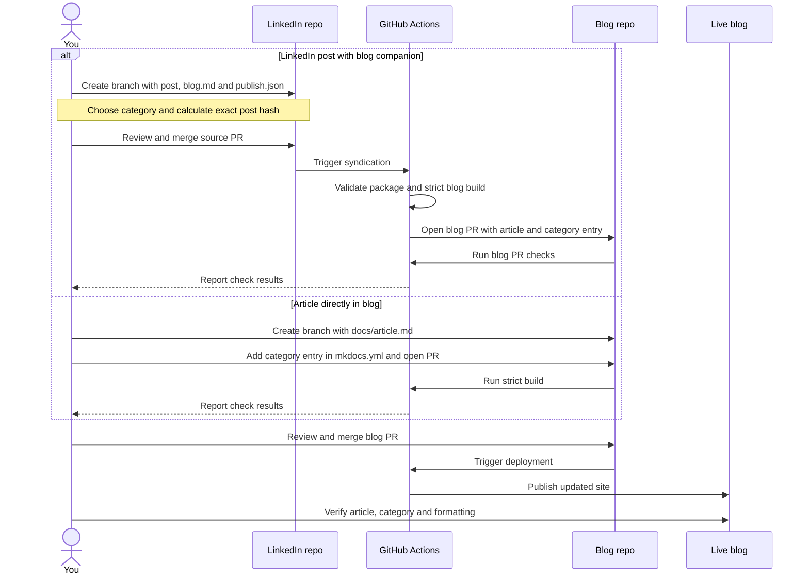

# Blog Publication Design

This design documents how a manually prepared article reaches Naren Cloud
Architecture Lab, either directly through the blog repository or through a
LinkedIn companion package. Both routes use reviewed pull requests.

## Publication Sequence

Checks must pass before the corresponding merge. A failed build or validation
stops that route until the source issue is resolved.

## Category Ownership

The blog uses the `nav:` sections in `mkdocs.yml` as its article categories.

| Entry route | Category source | Who updates blog navigation? |
| --- | --- | --- |
| LinkedIn companion | `publish.json` field `category` | Syndication renderer |
| Direct blog article | Existing section under `nav:` | Article author |

For example, [Zero Token Architecture](../../docs/zero-token-architecture.md) belongs
under **AI & Automation**. The category is selected by the author or publishing
agent; the workflow uses that selection.

For companion packages, use the exact spelling of an existing supported
category: Linux & Talos, AWS Solutions Architecture, SRE & Observability,
Kubernetes & Cloud Native, Platform Engineering & GitOps, Security & Registries,
Data & Messaging, or AI & Automation.

## Route 1: LinkedIn Post with a Blog Companion

Prepare the package in `linkedin/posts/<topic>/` on a source review branch:

| File | Purpose |
| --- | --- |
| `linkedin-post.txt` | Final plain-text LinkedIn post |
| `blog.md` | Richer companion article with one matching title |
| `publish.json` | Category, slug, date, public approval and post hash |
| `README.md` | Package context and delivery instructions |
| `assets/` | Optional explicitly selected article images |

Keep the supplied source material in `idea.txt`. Select images deliberately;
the workflow does not publish the private archive wholesale.

1. Review the text, companion article and public disclosure.
2. Set the publication title, slug, date and exact existing category.
3. Calculate SHA-256 from the exact bytes of `linkedin-post.txt`. Set
   `enabled: true` and `approved_public: true` only for a reviewed, ready package.
   Unfinished packages stay disabled.
4. Preview through the current hub renderer and run the strict blog build.
5. Open and merge the LinkedIn source PR.
6. Inspect **Syndicate LinkedIn to blog** in GitHub Actions.
7. Review the resulting blog PR, then merge it to deploy.
8. Verify the live article and its navigation entry.

The workflow triggers on merged changes to `posts/**` or its workflow file;
manual dispatch is also available. A local commit must reach `main` through
the reviewed source PR. Posting directly on LinkedIn is a separate action.

The renderer places the article at `docs/<slug>.md`, adds its category entry
once and records source/destination hashes for subsequent reconciliation.

## Route 2: Article Directly in the Blog

Follow [the publishing guide][publishing] on a branch from current `main`:

1. Create `docs/<article-slug>.md` with an outcome-focused introduction.
2. Add the file once under its chosen `nav:` section in `mkdocs.yml`.
3. Keep selected images in the documented article asset directory.
4. Run `python -m mkdocs build --strict` and `git diff --check`.
5. Inspect desktop/mobile presentation and open the blog PR.
6. Review and merge after checks pass.
7. Verify the deployed article, category, links and formatting.

The direct route needs no LinkedIn package or `publish.json`. Add homepage
or repository README links only when the article is selected as featured work.

[publishing]: https://github.com/naren4b/nks/blob/main/PUBLISHING.md

## Chronological Discovery

The [Articles](../../docs/articles.md) page lists dated articles newest first. The homepage previews the latest five. Both lists are generated from the existing navigation and each article’s `Published: YYYY-MM-DD` line; there is no second catalog to maintain.

For a direct article, put its intended original publication date below the H1 before opening the PR. Syndication supplies this line from the package date. Keep the original date when editing an article. Same-day entries sort by title. Older guides without recorded dates appear separately; file modification times are not publication dates.

## Updates and Completion

Maintain syndicated articles in their LinkedIn source package. Reconcile both
versions and refresh the post hash when either changes. Independently edited
blog content stops automatic replacement and requires source reconciliation.

The workflow opens or updates a blog review PR; the owner merges it.
A successful syndication run means a proposal was prepared, not that the
article is live. Blog merge triggers deployment, and live verification is a
separate completion step. LinkedIn posting remains manual.

## Repository-Only Reference

This document lives outside MkDocs' docs directory. View its Mermaid sequence
in GitHub. It is excluded from blog builds, navigation, search and article lists.
