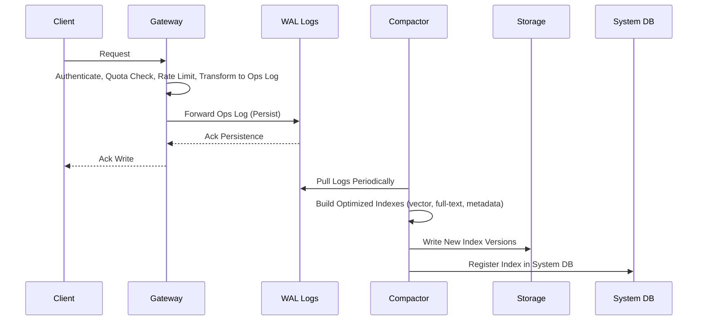
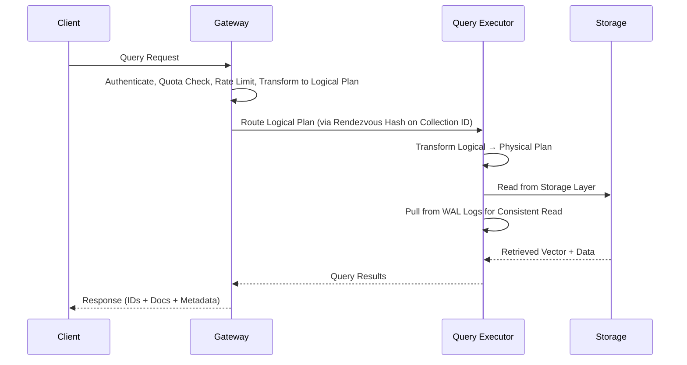

# Another Vector Store "Chroma"

Choosing the right vector database is a critical decision for any AI-powered application. Chroma is the open-source search and retrieval database for AI applications.

- It is open-source, highly customizable vector database.
- Chroma stands out for being free, open-source, and flexible. It’s perfect for developers or small teams who want complete control over their infrastructure and are willing to handle their own scaling and maintenance.

# 1. What it Offers?

---

- Store embeddings and their metadata
- Vector search
- Full-text search
- Document storage
- Metadata filtering
- Multi-modal retrieval

# 2. Different Deployment model?

---

- **Local:** as an embedded library - great for prototyping and experimentation.
- **Single Node:** as a single-node server - great for small to medium scale workloads of < 10M records in a handful of collections.
- **Distributed:** as a scalable distributed system - great for large scale production workloads, supporting millions of collections.
- **Chroma Cloud:** https://www.trychroma.com/ is a managed offering of distributed Chroma.

# 3. The Architecture

---


- **a. The Gateway:** The entrypoint for all client traffic. (Handles authentication, rate-limiting, quota management, and request validation)
- **b. The Logs:** Chroma’s write-ahead log ensures atomicity across multi-record writes. It is durability and replay in distributed deployments.
- **c. The Query Executor:** Vector similarity, full-text and metadata search. Maintains a combination of in-memory and on-disk indexes, and coordinates with the Log to serve consistent results.
- **d. The Compactor:** Reads from the Log and builds updated vector / full-text / metadata indexes. Writes materialized index data to shared storage. Updates the System Database with metadata about new index versions.
- **e. The System Database:** Chroma’s internal catalog. Tracks tenants, collections, and their metadata. Backed by a SQL database.
- **f. Storage & Runtime:** Deployment mode decides how they use storage and the runtime they operate in.
  - In Local and Single Node mode, all components share a process and use the local filesystem for durability.
  - In Distributed mode, components are deployed as independent services: - The log and built indexes are stored in cloud object storage. - The system catalog is backed by a SQL database. - All services use local SSDs as caches to reduce object storage latency and cost.

# 4. Operation flow: Write

---



1. Request arrives at the gateway, where it is authenticated, checked against quota limits, rate limited and then transformed into a log of operations.
2. The log of operations is forwarded to the write-ahead-log for persistence.
3. After being persisted by the write-ahead-log, the gateway acknowledges the write.
4. The compactor periodically pulls from the write-ahead-log and builds new index versions from the accumulated writes. These indexes are optimized for read performance and include vector, full-text, and metadata indexes.
5. Once new index versions are built, they are written to storage and registered in the system database.

# 5. Operation flow: Read

---



1. Request arrives at the gateway, where it is authenticated, checked against quota limits, rate limited and transformed into a logical plan.
2. This logical plan is routed to the relevant query executor. In distributed Chroma, a rendezvous hash on the collection id is used to route the query to the correct nodes and provide cache coherence.
3. The query executor transforms the logical plan into a physical plan for execution, reads from its storage layer, and performs the query. The query executor pulls data from the log to ensure a consistent read.
4. The request is returned to the gateway and subsequently to the client.
5. By default, `.query` and `.get` always return the documents and metadatas. You can use the include argument to modify what gets returned. IDs are always returned.

# 6. Example Code

---

```python
import chromadb
chroma_client = chromadb.Client()

# switch `create_collection` to `get_or_create_collection` to avoid creating a new collection every time
collection = chroma_client.get_or_create_collection(name="my_collection")

# switch `add` to `upsert` to avoid adding the same documents every time
collection.upsert(
    documents=[
        "This is a document about pineapple",
        "This is a document about oranges"
    ],
    ids=["id1", "id2"]
)

results = collection.query(
    query_texts=["This is a query document about florida"], # Chroma will embed this for you
    n_results=2 # how many results to return
)

print(results)

```
