# YouTube to Google Sheets Summarizer Bot

This project automates the process of watching a YouTube video, using Google's Gemini AI to extract structured information about specific topics (like stock charts), and populating a Google Sheet with the results.

The project is broken into three main, modular scripts orchestrated by a main bot script.

Complete code : https://github.com/naren4b/ai-journey/tree/main/cow_video_summary_bot 

## Workflow Diagram

The following diagram illustrates the complete data flow from the user's command to the final updated Google Sheet.

```mermaid
flowchart TD
    subgraph A0["Step 0: Setup & Initiation"]
        direction TB
        User["👨‍💻 User (Runs the Bot)"]
        Script["Video Summary Bot (Main Script)"]
        Env["API Key Config (.env)"]
        Creds["Google Auth Config"]
    end

    subgraph B1["Step 1: Fetch Transcript from YouTube"]
        direction TB
        Fetcher["Transcript Fetcher"]
        YTAPI["YouTube Transcript Service"]
        RawTranscript["Transcript Data (Raw Format)"]
    end

    subgraph C["Step 2: AI Analysis & Insights"]
        direction TB
        Processor["Gemini AI Processor"]
        Gemini["Google Gemini API"]
        SummarizedData["Chart Insights (AI Output)"]
    end

    subgraph D0["Step 3: Update Google Sheet"]
        direction TB
        SheetsUpdater["Sheet Formatter & Uploader"]
        SheetsAPI["Google Sheets API"]
    end

    subgraph D1["Final Destination"]
        FinalSheet["📊 'Chart Of The Week' Sheet"]
    end

    %% Connections
    User -->|Runs with YouTube URL| Script
    Env -->|API Key| Processor
    Creds -->|Auth Details| SheetsUpdater

    Script -->|Starts| Fetcher
    Fetcher -->|Requests Transcript| YTAPI
    YTAPI -->|Returns Data| Fetcher
    Fetcher -->|Saves Transcript| RawTranscript

    Script -->|Sends to Gemini| Processor
    Processor -->|Reads| RawTranscript
    Processor -->|Analyzes with Gemini| Gemini
    Gemini -->|Returns Chart Insights| Processor
    Processor -->|Saves Summary| SummarizedData

    Script -->|Triggers| SheetsUpdater
    SheetsUpdater -->|Reads Insights| SummarizedData
    SheetsUpdater -->|Sends Rows| SheetsAPI
    SheetsAPI -->|Updates| FinalSheet

```



## Project Structure

-   `video_summary_bot.py`: The main entry point and orchestrator. You run this script.
-   `transcript_fetcher.py`: Fetches the video transcript and saves it locally.
-   `gemini_processor.py`: Reads the local transcript, analyzes it with Gemini, and saves the structured results.
-   `sheets_updater.py`: Reads the structured results and updates the Google Sheet.
-   `credentials.json`: **(You must provide this)** Your secret key for the Google Cloud Service Account.
-   `.gitignore`: Tells version control which files to ignore.

## Setup

1.  **Install Python Libraries:**
    ```bash
    pip install google-generativeai youtube-transcript-api gspread google-auth-oauthlib
    ```

2.  **Google Cloud & Sheets API:**
    -   Create a Google Cloud Project and enable the **Google Sheets API** and **Google Drive API**.
    -   Create a **Service Account** with the **Editor** role.
    -   Create a **JSON key** for the service account and download it. Rename the file to `credentials.json` and place it in this project folder.
    -   Share your target Google Sheet (`Chart Of The Week`) with the `client_email` found inside your `credentials.json` file, giving it "Editor" permissions.

3.  **Set Environment Variables:**
    This project requires environment variables for security.

    **On Windows (Command Prompt):**
    ```cmd
    set GEMINI_API_KEY="YOUR_GEMINI_API_KEY_HERE"
    set GOOGLE_CREDENTIALS_JSON="credentials.json"
    ```

    **On macOS/Linux:**
    ```bash
    export GEMINI_API_KEY="YOUR_GEMINI_API_KEY_HERE"
    export GOOGLE_CREDENTIALS_JSON="credentials.json"
    ```

## How to Run

Execute the main bot script from your terminal, providing the YouTube video URL as a command-line argument.

```bash
python video_summary_bot.py "https://www.youtube.com/watch?v=15wSdRs7Z78"
```

The script will run through the three steps (fetching, processing, updating) and print its progress. Upon completion, your Google Sheet will be updated with the extracted information.
