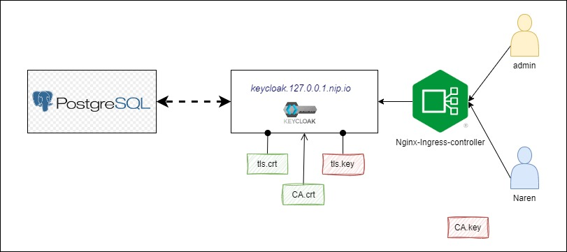

# Setup Production Grade Keycloak in Kubernetes(1/n)

Add authentication to applications and secure services with minimum effort.Keycloak provides user federation, strong authentication, user management, fine-grained authorization, and more.

# prerequisite

- KIND Cluster[Host your test kubernetes cluster](https://naren4b.github.io/nks/mykindk8scluster.html)
  - Ingress controller
  - Storage Class
- Certificates [Setting up your Own PKI with OpenSSL](https://naren4b.github.io/nks/openssl-certificate.html)

# Install postgres

```
kubectl apply -f /apps/postgres/pg-password.yaml
kubectl apply -f /apps/postgres/pgdb.yaml

kubectl get pod
```

# Install keycloak

```
kubectl apply -f /apps/keycloak/ingress.yaml
kubectl apply -f /apps/keycloak/keycloak-tls.yaml
kubectl apply -f /apps/keycloak/keycloak.yaml

kubectl get pod
kubectl get ing
```
