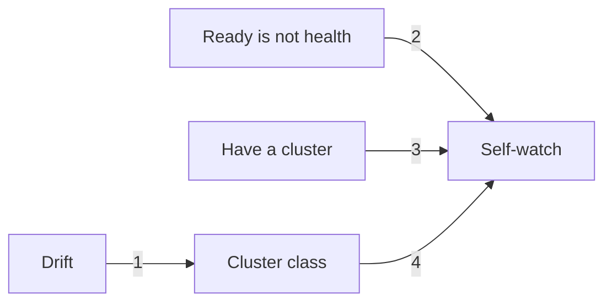

# Repeatable Kubernetes, honest health

Most sites can stand up a cluster. Few can **repeat** the next one, or tell **Ready** from actually well.

This paper is two contracts: a **cluster class** you can replicate without SSH snowflakes, then **one factory** that watches Kubernetes first — not a Prometheus per team.

**Key:** 1 snowflake hosts → versioned class · 2 vanity Ready → one factory · 3 skip the cluster file if kube already exists · 4 watching is optional; a proven class is complete

## Architectural thesis

Treat the cluster as a product with three explicit contracts: **desired state** (versioned machine configuration), **runtime state** (Kubernetes and host control planes), and **evidence** (metrics, logs, alerts, and prove-up checks). A cluster is not complete because it was installed, and monitoring is not complete because a dashboard loads. The design closes the loop from repeatable change to observable operation.

| Door | When it is done |
|------|-----------------|
| [Cluster class](k8s/TALOS/README.md) | Same params, same cluster. Nodes Ready **and** schedulable. No SSH. |
| [Self-watch](monitoring/PGAL/README.md) | One collect / store / alert / show path. Control plane is the first tenant. |

| You have | You want | Open |
|----------|----------|------|
| Nothing | Full environment | Cluster class, then self-watch |
| A cluster (any distro) | Self-watch | [Self-watch](monitoring/PGAL/README.md) |
| Cluster + Prom / Loki / Grafana / Alloy | Kube jobs only | Self-watch — jump to Sequences / Prove it (kube jobs) |
| Need only a cluster class | Cluster | [Cluster class](k8s/TALOS/README.md) |

Stopping after a proven cluster is valid. Self-watch is optional.

**Not this:** application APM, service mesh, product exporters, a Helm catalog. Those attach later as **tenants of the factory**.

## Operating model

| Stage | Decision | Evidence of completion |
|-------|----------|-------------------------|
| Define | Pin the cluster class, identity planes, storage, network, and control-plane count | Versioned parameters and ownership are reviewable |
| Build | Apply machine configuration through the machine API | Nodes register without SSH drift |
| Prove | Check quorum, schedulability, API behavior, and machine access | The cluster passes the readiness contract |
| Observe | Collect component metrics and logs, then route actionable alerts | The platform can explain failure, not only display it |
| Operate | Upgrade, replace, restore, and scale through the same contracts | Day-two changes are repeatable and auditable |

The two cookbooks cover **Define through Observe**. Upgrade policy, backup and restore, disaster recovery, organization-wide identity, and production deployment manifests remain implementation chapters, not hidden promises.

**Later:** many clusters, one Grafana, Thanos/Mimir when local storage is not enough. Apps use the same labels (`cluster`, `namespace`, `team`).

The tables in the two files **are** the contract. Turning those params into automation is the implementation.
