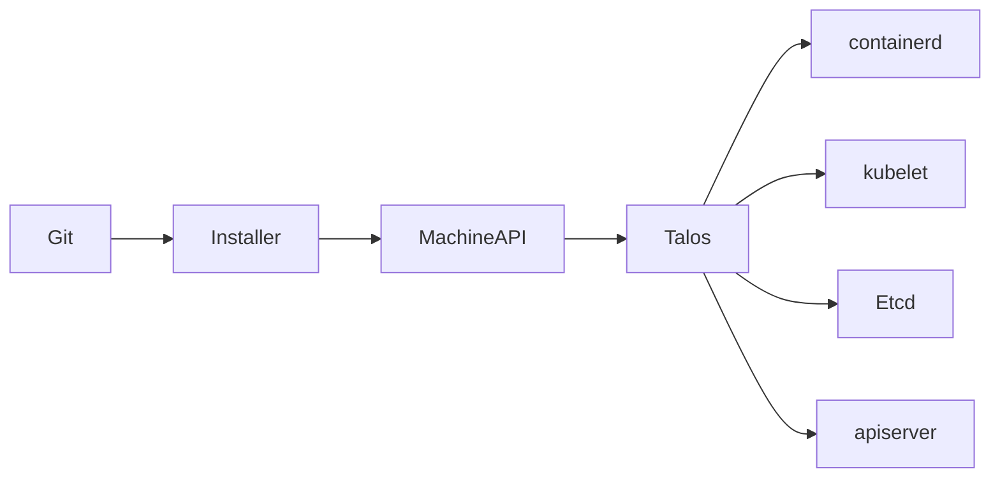
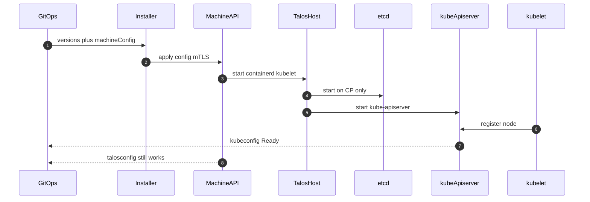
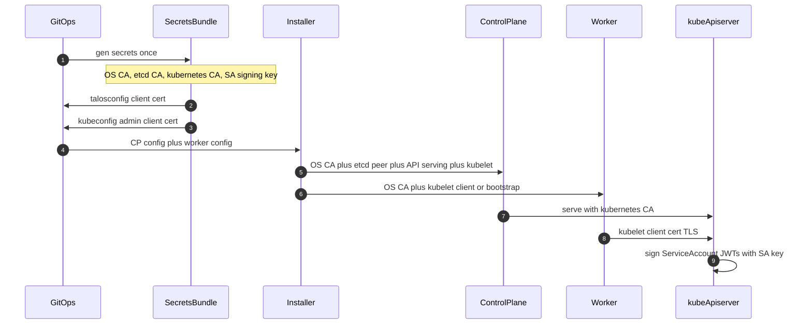
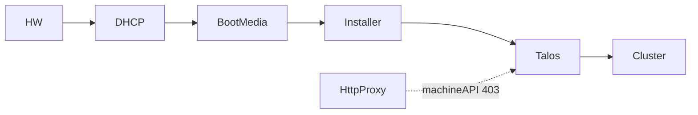

# Kubernetes cluster on Talos

## Objective

SSH became the control plane; every site drifted. This file is the opposite: **versioned machine config in**, nodes Ready **and** schedulable out.

Stopping after **Prove it** is a complete use of this document. Watching the cluster is a later contract.

## Start here

| | |
|--|--|
| You need | Metal or VMs, an installer (Omni / `talosctl` / Cluster API), pinned Talos and Kubernetes versions |
| You produce | `kubeconfig`, `talosconfig`, nodes Ready **and** schedulable, etcd quorum, machine API reachable |
| Skip this doc when | You already have a working cluster (any distro). Open [self-monitoring](../../monitoring/PGAL/README.md) and match **its** facts |
| Stopping here is valid | Observability is optional. A proven cluster is a complete use of this file |

## Tech stack (revision)



**Talos Linux** is a purpose-built, immutable OS whose only job is to run Kubernetes: it starts **containerd** and **kubelet** on every node, and **etcd** on the control plane, as host services — there is no SSH, no package manager, and no general-purpose userspace to drift. You need it so the host is a versioned API object (machine config in, Ready nodes out) instead of a snowflake distro you `apt` and hope. The OS is small on purpose: fewer packages, fewer login paths, upgrades are apply/reboot not SSH. Remember: installer “connected” is not Kubernetes **schedulable**; `/readyz` is not the platform SLO.

**Machine API** is Talos’s mTLS gRPC control plane on the host (apply config, upgrade, disks, logs). You need it because there is no SSH — this *is* how humans and installers talk to the box. It uses the **OS CA**, not the kubernetes CA; `talosconfig` is the client, `kubeconfig` is not. HTTP proxies must bypass this path with literal CIDRs in `NO_PROXY` (brace expansion is not a CIDR), and boot-time kernel env must match runtime `machine.env` or the first apply never happens.

**Machine config** is the versioned YAML that describes a node class: disks, network, kubelet, env, and the certs that node is allowed to hold. You need it so the same **params** (Talos version, Kubernetes version, odd CP count, disk classes) produce the same cluster class anywhere the prerequisites match. Git is the source of truth; the installer UI is not. Boot network (DHCP/PXE) is often not the runtime/bonded address — do not encode the wrong family. Workers never receive etcd peer keys; rotating a CA is a cluster event (new secrets → new config → apply), not a file copy onto disk.

**Installer (Omni / `talosctl` / Cluster API)** is three products with one contract: take pinned versions plus machine config, call the machine API, emit `kubeconfig` and keep `talosconfig` working. You need one of them to bootstrap without SSH; do not productize the UI — productize the params. Pin both Talos and Kubernetes to the support matrix; an upgrade is a change, not a hop. Cluster API is the same contract expressed as Kubernetes objects; Omni and `talosctl` are the same apply loop with a different front door.

**containerd** is the CRI runtime Talos runs as an OS service so kubelet can start pods. You need it because Kubernetes does not run containers itself. It is a **host process**, not a Pod — if it is down, the node may still look “connected” in the installer while every workload fails. Treat it as part of the machine, not something you `kubectl restart`.

**kubelet** is the node agent: it registers with the apiserver, runs pods, and reports Ready/NotReady. You need it for a schedulable worker (and for static control-plane processes on some distros). cAdvisor is a **path on kubelet `:10250`**, not a separate product. Remember: NotReady is not “almost”; leftover cordon/taint means installer-connected and still `Pending` pods.

**etcd** is the Raft consensus store for cluster state, running only on control-plane nodes, with an **odd** member count (default 3). You need it because kube-apiserver is a front door; durable writes live here. Give it a fast dedicated disk — extra workers do not buy etcd IOPS or peer RTT. Quorum is majority of members; an even CP count is a lab footgun. Workers must never hold etcd peer keys.

**kube-apiserver** is the HTTPS `:6443` front door: objects, authn/z, ServiceAccount JWTs (signed with the SA key from the secrets bundle). You need it so kubectl, kubelet, and GitOps share one Kubernetes API. `/readyz` 200 means it will serve, not that LIST p99 or etcd quorum is healthy. Admin identity here is **kubeconfig** (kubernetes CA); host identity is **talosconfig** (OS CA) — two planes, two RBAC stories.

**Secrets bundle** is generated **once per cluster** (`talosctl gen secrets`, Omni, or Cluster API): OS CA, etcd CA, kubernetes CA, SA signing key. You need it so nodes do not invent a second PKI — machine config **carries** certs; it does not mint them. Humans get `talosconfig` + `kubeconfig`; each node gets only its role (CP gets etcd peer material, workers do not). Mixing CAs (machine client against `:6443`, or kube token against the machine API) is the classic auth failure.

**kubeconfig** is a client cert for the **Kubernetes** API. **talosconfig** is a client cert for the **machine** API. You need both: one to run the cluster, one to run the hosts (upgrade, logs, disks). GitOps/Argo CD consume kubeconfig + RBAC; installers and host ops consume talosconfig. Losing talosconfig while kubeconfig still works means you can schedule pods and cannot patch the OS — that is a broken platform, not a working one.

## Orchestration

Who calls whom. No SSH. The installer talks to the **machine API**; kubelet talks to the **Kubernetes API**.



**Key:** 1 Git is source of truth · 2 machine API (not SSH) · 3–5 host processes · 6 kubelet joins · 7–8 two admin planes.

### Certificates — create and distribute

Secrets are generated **once per cluster** (`talosctl gen secrets`, Omni, or Cluster API). Machine config **carries** the CAs and node certs. Nodes do not invent a second PKI.



**Key:** 1 one bundle · 2–3 humans get `talosconfig` + `kubeconfig` · 4–5 nodes get only what their role needs · 6–8 kubelet and SA tokens are **Kubernetes** identity, not the machine API.

| Material | Created by | Distributed to | Used for |
|----------|------------|----------------|----------|
| **OS CA** + machine client | Secrets bundle | Every node + `talosconfig` | Machine API mTLS (apply, upgrade, logs) |
| **etcd CA** + peer/client certs | Secrets bundle | **CP nodes only** | etcd peer and etcd API TLS |
| **kubernetes CA** + API serving cert | Secrets bundle | CP (`kube-apiserver`) | HTTPS `:6443` |
| **kubelet client** (or bootstrap then CSR) | kubernetes CA | Every node | kubelet → apiserver |
| **admin kubeconfig** | kubernetes CA + client cert | Operators / GitOps | `kubectl` |
| **SA signing key** | Secrets bundle | `kube-apiserver` only | in-cluster ServiceAccount JWTs |

Workers never receive etcd peer keys. Rotating a CA is a **cluster event** (new secrets → new machine config → reboot/apply), not an SSH copy onto disk.

## What you can promise

| Promise | Bound | Not included |
|---------|--------|--------------|
| Time-to-cluster | Hours after metal/VMs + installer exist | App platform, mesh, storage classes |
| HA control plane | CP count **odd**, default **3** | Infinite API QPS |
| Workers | Count scales **linearly** with compute | etcd IOPS or apiserver QPS |
| Identity | Two planes: **K8s RBAC** vs **Talos machine API** | Single SSO story without org IAM |
| Cost shape | Small OS + no SSH fleet; CP disk class dominates HA cost | “Free” extra control planes |
| Repeatability | Same **params** → same cluster class | Identical hardware SKUs |

Fewer host logins, fewer drift paths, a checklist a later script can encode — not a feeling.

## Lifecycle and ownership

The machine configuration repository owns the desired cluster class; the installer owns delivery; Talos owns host enforcement; Kubernetes owns workload and in-cluster access; the platform operator owns proof checks, upgrades, and incident response. No single tool owns the whole lifecycle. Record the owner and rollback path for every change before applying it.

| Lifecycle event | Primary control | Required evidence |
|-----------------|-----------------|-------------------|
| Bootstrap | Installer + machine config | Secrets source, version pins, node role, and recovery access recorded |
| Add or replace a node | Machine API + Git change | Node class matches, etcd membership is safe, workloads reschedule |
| Upgrade | Versioned machine config + staged apply | Support matrix checked, quorum protected, rollback tested |
| Recover | etcd snapshot / platform backup procedure | Restore point, credentials, and application impact are known |
| Retire | Machine API + identity revocation | Node removed from cluster and old credentials invalidated |

This document defines the cluster substrate and its proof boundary. A production platform still needs an organization-specific runbook for etcd backup and restore, secrets recovery, identity integration, maintenance windows, and disaster recovery testing.

## Platform contract

**Why Talos (vs kubeadm + SSH hosts)**

| Property | Talos | kubeadm / SSH snowflake |
|----------|--------|-------------------------|
| Login | No SSH; **machine API** only | Root/SSH is the control plane |
| Source of truth | **Machine config** (versioned YAML) | Node state + tribal runbooks |
| Surface | Small OS; kubelet + containerd as Talos services | Full distro + packages |
| Drive | API apply/reboot/upgrade | Imperative install, then hope |

**Inputs a later script would take**

| Param | Constraint |
|-------|------------|
| `talosVersion` | Pin; upgrade as a change, not a hop |
| `kubernetesVersion` | Pin; must match Talos support matrix |
| `controlPlaneCount` | Odd; **3** for HA |
| `workerCount` | ≥1 for workloads; 0 is CP-only lab |
| `etcdDisk` vs `workloadDisk` | Separate classes; etcd is not “another volume” |
| `bootNetwork` vs `runtimeNetwork` | May differ; do not assume DHCP IP = cluster IP |
| `installer` | Omni **or** `talosctl` **or** Cluster API — same contract |

**Install path (mental model)**

Machine config → installer applies it → Talos starts **containerd** and **kubelet** (and **etcd** on control plane) → Kubernetes **API** comes up. Operators talk to **apiserver** (workloads) and **Talos machine API** (hosts). There is no “SSH in and apt install kubelet.”

**Platform ready** is **not** `/readyz` alone.

## Decisions

| Decision | Default | Why |
|----------|---------|-----|
| CP count | 3 | Quorum; 1 is a lab |
| etcd disk | Fast, dedicated | Quorum latency is the cluster |
| Worker disk | Cheap/large OK | Workloads, not etcd |
| Installer | Any of three | Do not productize the installer UI |
| Machine config | Git | Replicate the **class**, not the click path |
| CP taints | Keep | Workloads on workers unless you chose otherwise |

Workers add capacity **linearly**. What does **not**: etcd disk class, apiserver QPS, etcd peer RTT. Under load, **etcd and the API** break first; extra workers will not save a slow etcd disk.

## Prove it

Checks a script can run. All must pass for **platform ready**.

| Check | Pass means |
|-------|------------|
| Nodes `Ready` | kubelet registered; NotReady is not “almost” |
| Workers **schedulable** | No leftover cordon/taint that blocks default pods |
| `GET /readyz` | Apiserver will serve; **necessary, not sufficient** |
| `GET /livez` | Process alive; still not “platform” |
| etcd **quorum** | Member list healthy; CP=3 ⇒ majority of 3 |
| kubelet healthy | Node conditions clear; not only “connected” in an installer |
| Machine API reachable | Config apply/upgrade path still works (proxy must not eat it) |

`/readyz` 200 + installer “connected” can still mean **unschedulable** workers or a machine API the proxy swallowed.

## When it breaks

| Mode | Symptom | First look |
|------|---------|------------|
| Quorum loss | API hangs, writes fail | etcd members, disk, CP count even/odd |
| Proxy on machine API | Installer “connected”, node not available / not joining | `NO_PROXY` CIDRs; boot env vs runtime env |
| Boot ≠ runtime net | Ping the wrong address family | DHCP/PXE address vs runtime / bonded address |
| Connected ≠ schedulable | Installer shows connected, pods `Pending` | `Ready`, taints, cordon, CNI |
| Disk mixup | etcd slow, workers “fine” | etcd on HDD while workers sit on SSD |
| Version skew | kubelet/API mismatch | Pinned versions vs support matrix |

## Beyond

Same **params** → many clusters of one **class**. GitOps the **machine config** (and installer objects), not a human click trail. Stopping after **Prove it** is valid. [Self-monitoring](../../monitoring/PGAL/README.md) is **optional**; it consumes the **hooks** below. Do not design scrape of etcd/kubelet here.

**North / south metadata (hooks, not products)**

| Artifact | Who uses it |
|----------|-------------|
| `kubeconfig` | Humans, CI, GitOps (Argo CD) |
| `talosconfig` | Machine API (upgrade, logs, disks) |
| Labels / taints | Scheduling contract |
| GitOps needs | Cluster exists, RBAC for the GitOps SA, default StorageClass later |
| Monitoring hooks (if self-monitoring comes later) | kubelet `:10250`, etcd client certs, controller bind addresses |
| Identity | **Kubernetes RBAC** (in-cluster) ≠ **Talos RBAC** (hosts) |
| Audit | Kubernetes **API audit logs**; machine API access is a separate trail |

## Worked example

**Lesson:** boot network is often **not** the runtime network; an HTTP proxy must **not** intercept the **machine API**; installer **connected** is not **schedulable**. Encode `NO_PROXY` as real CIDRs (brace expansion is not a CIDR). Align **early-boot** kernel env with **steady-state** machine config.



**Key:** PXE/ISO on one network · Talos runtime on another · proxy must bypass the machine API (SideroLink / gRPC), not only HTTPS to the installer UI.

| Phase | Config source | Typical miss |
|-------|---------------|--------------|
| Install / PXE | DHCP + `boot.ipxe` / ISO `talos.environment` | `no_proxy` missing on **first** kernel |
| Runtime | Machine config `machine.env` | Patch has CIDRs; boot.ipxe still has brace expansion |

```yaml
# Literal CIDRs only. Brace expansion is not a CIDR.
no_proxy: localhost,127.0.0.1,::1,10.0.0.0/8,169.254.0.0/16,.svc,.cluster.local
NO_PROXY: localhost,127.0.0.1,::1,10.0.0.0/8,169.254.0.0/16,.svc,.cluster.local
```

Firmware boot order is a **photo of the box**, not a diagram: network/PXE **before** disk. Capture that from BMC/BIOS when a node never starts iPXE.

Installer **connected** + API `/readyz` 200 can still mean unschedulable workers. Prove with the table in **Prove it**.

---

*The product is the contract above. No sidecar runbook.*
