# Kubernetes self-monitoring

## Objective

`/readyz` 200 is sold as health, and every team stands up another Prometheus. This file is one collect / store / alert / show factory, with the control plane as tenant zero.

If the factory already exists, jump to **Sequences** / **Prove it** (kube jobs). Do not reinstall.

## Start here

| | |
|--|--|
| You need | `kubeconfig`, nodes Ready, a StorageClass that can provision PVCs for Prometheus and Loki |
| You produce | Alloy, Prometheus Operator, Prometheus, Loki, Grafana, Alertmanager **Ready**; six kube jobs `up` (or five + documented no kube-proxy); Alloy lines for apiserver/etcd/kubelet; control-plane Grafana |
| Factory already exists | Jump to **Sequences** / **Component table** / **Prove it** (kube jobs). Do not reinstall |
| Skip this doc when | Factory + kube jobs already proven |
| Distro | Any Kubernetes. You do **not** need [Talos](../../k8s/TALOS/README.md). Talos extras are a table variant |

## Tech stack (revision)

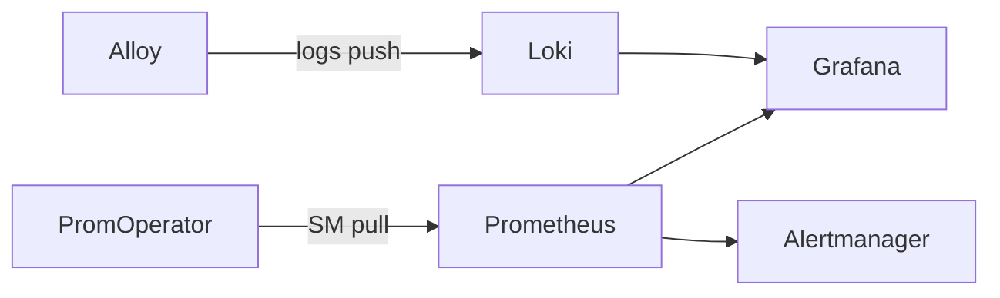

**Grafana Alloy** is the collector (DaemonSet): it tails logs and can scrape, then **pushes** to Loki (and optionally remote-writes metrics). You need it so a new Pod is auto-wired without a ticket, and so host processes still have a shipper when they are not Pods. Drop health-probe spam; keep `cluster` / component labels identical to metrics. Kubernetes pod discovery **does not see** node binaries (Talos etcd, static kube-apiserver): use journal, hostPath file, or the Talos machine API. Metrics `up=1` with empty Loki is usually this gap, not a Loki outage.

**Prometheus** is a pull-based TSDB: it `GET /metrics` on a schedule, stores series, and evaluates **PrometheusRule**s. You need one factory store so you do not run a Prometheus per team. Cost is **samples/s** and cardinality, not node count; unbounded IDs as labels will OOM it. `up=1` means the scrape succeeded — it is not the SLO (LIST p99, etcd fsync, kubelet PLEG are). Retention locally is ~15d; many clusters or long history → Mimir/Thanos, not a bigger PVC forever.

**Prometheus Operator** watches CRs (**ServiceMonitor**, **PodMonitor**, **PrometheusRule**, **Prometheus**) and writes scrape config into the Prometheus pod. You need it so GitOps adds a job by shipping YAML, not by editing `prometheus.yml`. It **does not mint tokens**: you create the SA/RBAC or copy etcd PEMs; the SM **names** a Secret; the Operator **mounts** it. 403 is the wrong issuer (`bearerTokenFile` / Prometheus’s own SA against another API). `secret not found` is mount/RBAC, not PromQL.

**ServiceMonitor** (and PodMonitor) is the discovery object: select a Service, scrape a port **name** (not `6443`), with optional `bearerTokenSecret` or `tlsConfig`. You need it so new annotated Services join the factory. For host processes, pair a headless Service with **Endpoints = node IPs** — pod SD finds nothing. Do not overwrite the app Service to add a metrics port; ship an extra metrics Service (KCM `:10257`, scheduler `:10259`). Reuse kube-prometheus kubelet/apiserver jobs if they are already `up`.

**Loki** is a label-indexed log store (not Elasticsearch full-text). You need it to keep control-plane and node logs cheaply beside metrics, same `cluster`/`namespace`/`team` labels. Default retention 7–14d local; alert on ingest lag and WAL **before** the PVC fills. Multi-tenant means labels and Grafana folders, not a Loki per squad. Empty streams with healthy metrics usually mean Alloy used kubernetes SD on a process that is not a Pod.

**Grafana** is the query UI over Prometheus (PromQL) and Loki (LogQL), plus folders and SSO. You need one glass so teams do not each own a dashboard island — kube is tenant zero; apps later use the same labels. Dashboards are not the pager; Alertmanager is. SSO outage darkens Grafana; Prometheus and Loki must stay reachable for SRE. Prefer one org + `cluster` variable over copy-paste Grafana per cluster.

**Alertmanager** receives firing alerts from Prometheus and **routes** them (`severity`, `team`/`owner`) to pagers and chat. You need it so a Grafana panel threshold is not your on-call contract. Day-one pages: factory mute (`up=0`, PVC %), kube job `up`, etcd quorum/disk, apiserver LIST/terminations, kubelet PLEG — not the full kube-prometheus dump. Mute of the **factory** pages platform, not the app team.

**kube-apiserver** is the request front door (`:6443 /metrics` HTTPS). You scrape it so LIST p99, 5xx, and terminations are visible while `/readyz` still returns 200. Use a ServiceAccount JWT issued by **that** API (`bearerTokenSecret`); a host token from another API is 403. ServiceMonitor `port` is the Service **name**. Alloy: keep errors and slow verbs; drop healthz spam. Always label `cluster`.

**etcd** is the consensus store (`:2379 /metrics` HTTPS **client cert**, not a kube JWT). You scrape each member so `up` count tracks membership and you see fsync/commit p99 before elections start. On Talos (and some kubeadm layouts) it is a **node binary**: Endpoints = CP node IPs; logs from journal/file/machine API, not pod tail. Copy PEMs into a Secret yourself. Never restart all members to “fix” quorum; disk class dominates.

**kube-controller-manager** runs reconciliation loops (secure metrics `:10257`). You scrape workqueue depth/retries so objects in `kubectl` are not silently stale. It often binds **localhost** until you expose it — insecure `:10252` lies or dies. Extra metrics Service (or node-IP Endpoints); do not overwrite the app Service. Auth is this process’s, not “any cluster token.” Logs: leader and crash-loop, not a substitute for workqueue metrics.

**kube-scheduler** places pods (secure metrics `:10259`). You scrape pending vs schedule attempts and e2e latency so you can blame scheduler vs kubelet/CNI. Same localhost and extra-Service pattern as KCM. Idle scheduler + `Pending` pods is often quota, taint, or CNI — not a dead scheduler. Alloy: unschedulable lines; metrics still decide the culprit.

**kubelet** is the node agent; **cAdvisor lives here** (`:10250` `/metrics`, `/metrics/cadvisor`, `/metrics/probes` — no `:4194`). You scrape it for PLEG relist, runtime errors, and Ready vs `kube_node_status_condition`. Reuse the kube-prometheus kubelet ServiceMonitor if it is already `up`. One `up` per Ready node. Alloy: PLEG, runtime, eviction — one stream per node.

**kube-proxy** is the node dataplane (iptables/IPVS/nft, `:10249`) **unless the CNI replaced it**. You scrape sync/restore errors when it exists; if it does not, missing `up` is success — document the skip. Tail kube-proxy **or** the CNI agent, not both as if they were required. Auth is often none on localhost; still the proxy listener if bound.

## Collection architecture

**Factory**

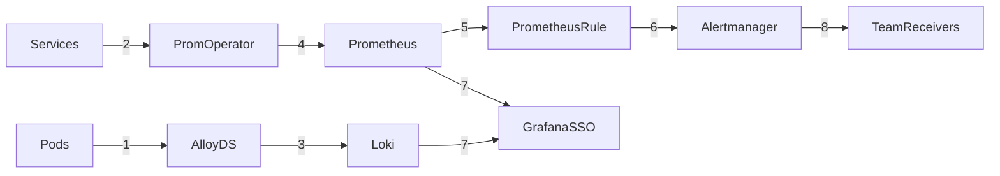

**1** logs push · **2** ServiceMonitor pull · **3** Loki · **4** TSDB · **5** rules · **6** Alertmanager · **7** Grafana · **8** route on `team`/`owner`

Kubernetes components are the **first** ServiceMonitors and log streams on this factory. Apps later use the same labels.

## Lifecycle and ownership

GitOps owns collectors, scrape identities, dashboards, rules, retention, and routing as versioned configuration. The platform operator owns the service-level objectives, cardinality budget, access review, and incident response. Application teams only add labeled telemetry and alerts that have a named owner. This boundary keeps the factory reusable without making it responsible for application semantics.

| Lifecycle event | Primary control | Required evidence |
|-----------------|-----------------|-------------------|
| Bootstrap | Operator manifests + GitOps | Canary metric, canary log, test alert, and PVC policy pass |
| Change a target | ServiceMonitor / PodMonitor + identity Secret | Target appears once, authenticates, and has an owner label |
| Rotate identity | TokenRequest or PKI process + Secret replacement | Old credential revoked or expired; scrape remains healthy |
| Scale clusters | Federation / remote write / Mimir or Thanos decision | Samples, log volume, cardinality, and failure domain are budgeted |
| Recover | Store backup and restore procedure | Recovery point and recovery time are tested, not assumed |

This document defines the collection and diagnosis contract. It does not prescribe one Helm chart, storage vendor, SSO provider, backup product, or multi-region topology; those are deployment decisions that must be made against retention, compliance, and recovery requirements.

**Metrics pull**

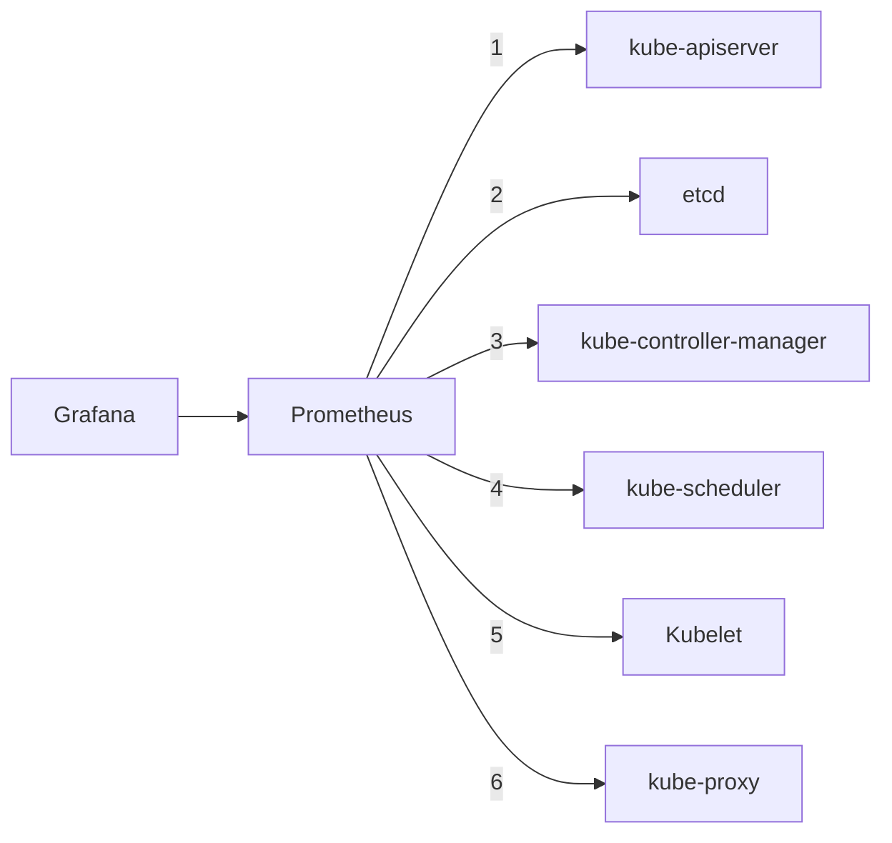

**1–6** `GET /metrics` · Grafana PromQL

**Logs push**

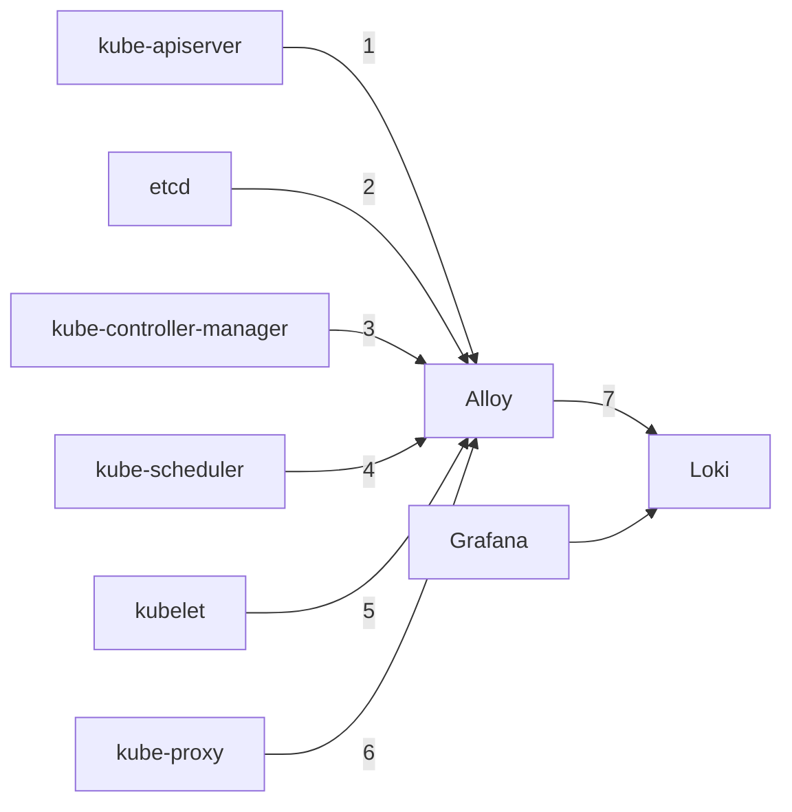

**1–6** tail process · **7** Loki · Grafana LogQL

## Sequences

### Metrics collection

#### Pattern

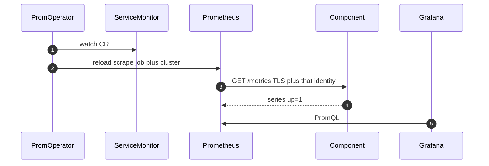

**Key:** 1–2 discover · 3–4 pull · 5 humans. Alertmanager is off-diagram (PrometheusRule on Prometheus). Identity and port change per job.

#### kube-apiserver

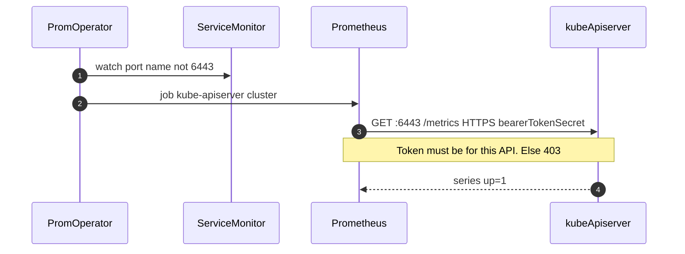

**Key:** SM `port` is a **name** · SA for **that** API.

#### etcd

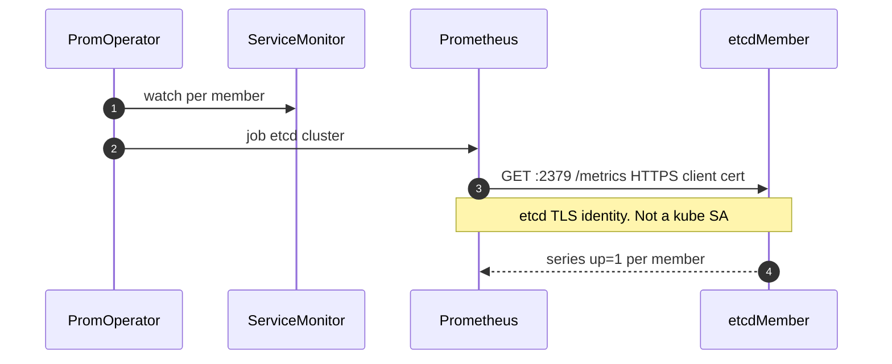

**Key:** One target per member · client cert · `up` count vs quorum. If etcd is a **node binary**, the SM selects Endpoints of **node IPs**, not a Pod (see **When the component is not a Pod**).

#### kube-controller-manager

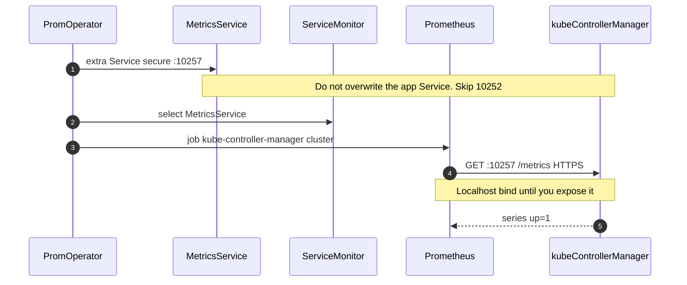

**Key:** Extra metrics Service · this process’s auth · localhost until bound.

#### kube-scheduler

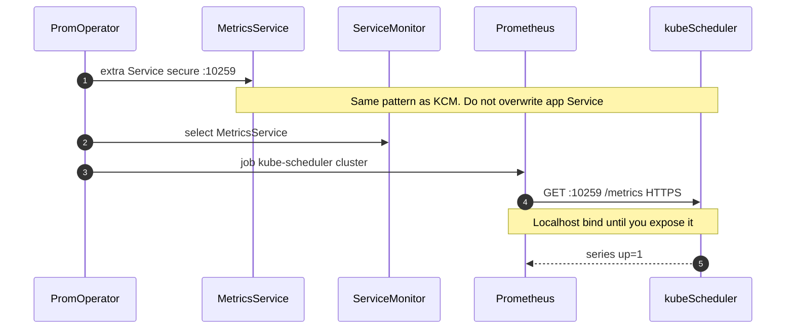

**Key:** Extra metrics Service on **10259** · this process’s auth.

#### kubelet

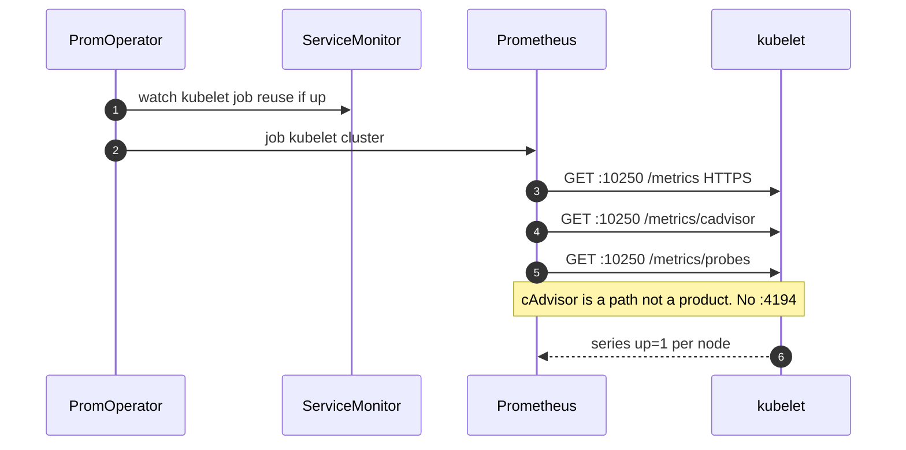

**Key:** Reuse kube-prometheus kubelet SM if already `up` · three paths on **:10250**.

#### kube-proxy

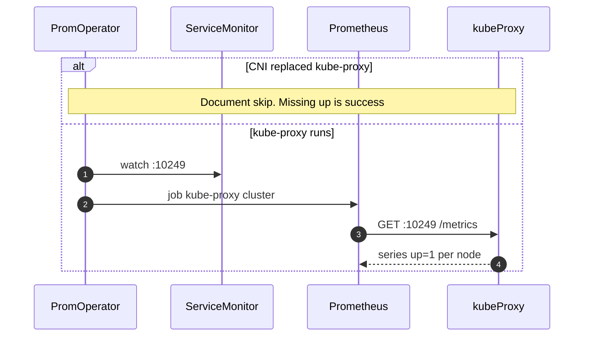

**Key:** Skip if CNI owns dataplane · else scrape **:10249**.

### Log collection

#### Pattern

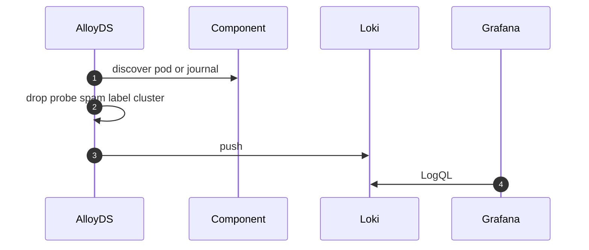

**Key:** 1 discover · 2 filter · 3 push · 4 humans. Same labels as metrics (`cluster`, component). If the process is **not a Pod**, discover journal/file/machine API — not the Pod list.

#### kube-apiserver

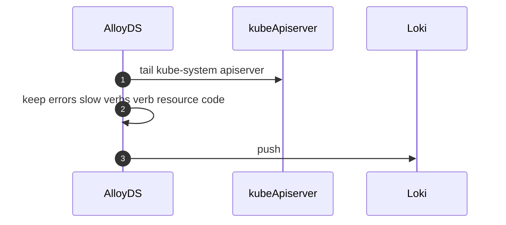

**Key:** Keep errors and slow LIST/GET · drop healthz spam.

#### etcd

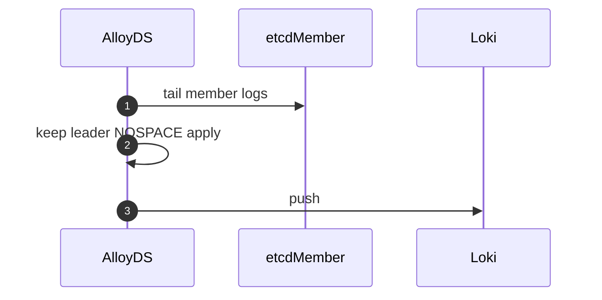

**Key:** One stream per member · leader / NOSPACE / apply. If etcd is a node binary, tail **journal/file/machine API**, not a Pod.

#### kube-controller-manager

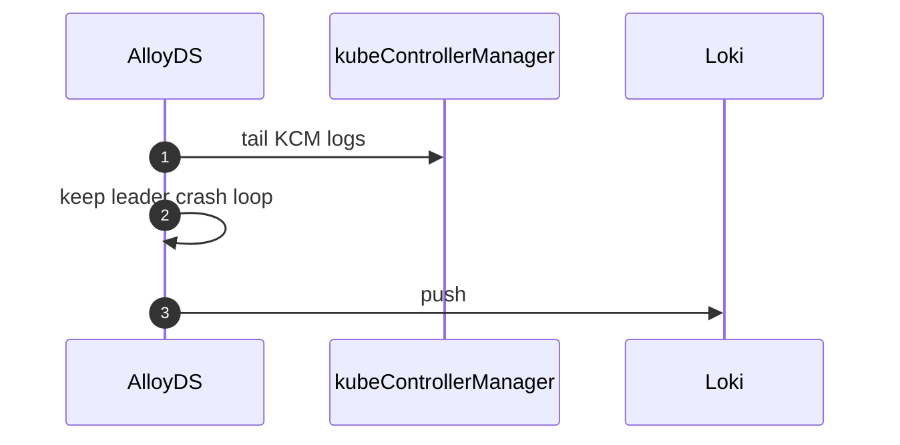

**Key:** Leader and crash-loop lines · not a substitute for workqueue metrics.

#### kube-scheduler

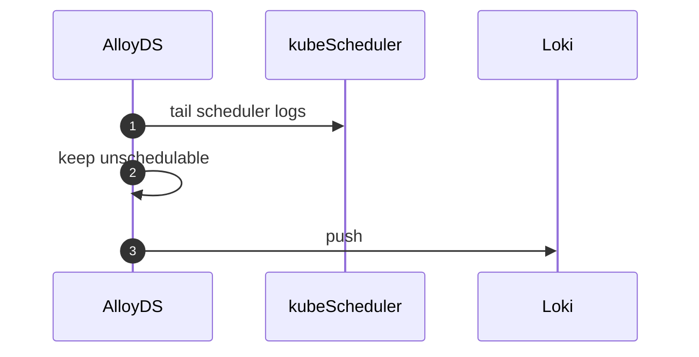

**Key:** Unschedulable events · pending pods still need metrics to blame kubelet vs scheduler.

#### kubelet

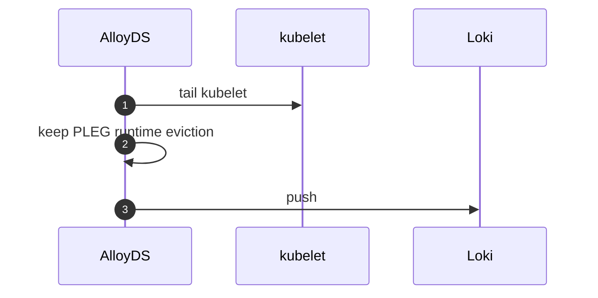

**Key:** PLEG / runtime / eviction · one stream per node.

#### kube-proxy

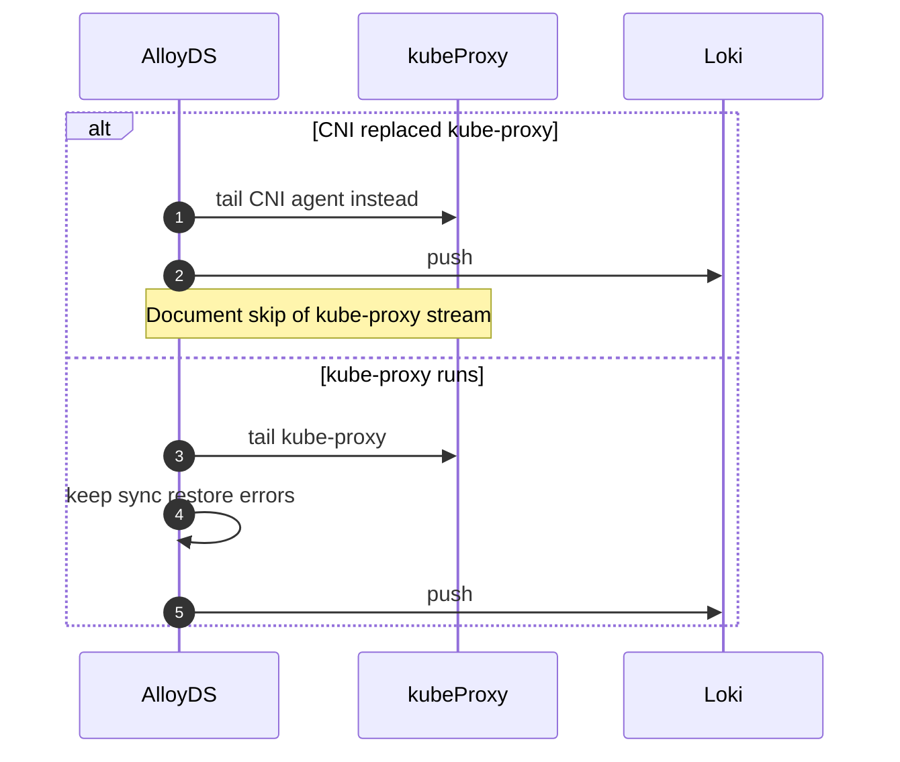

**Key:** Tail kube-proxy **or** the CNI agent · do not expect both.

## What you can promise

| Promise | Bound | Not a promise |
|---------|-------|----------------|
| MTTD for platform mute | Scrape `up=0` and PVC % fire in minutes | App SLOs (later tenants) |
| Auto-wire | New pod logs; new Service with SM/PM | Custom exporters nobody labeled |
| Tenant isolation | Grafana folders + labels `cluster` `namespace` `team` | A Loki per squad |
| No silent data loss | Disk/ingest alerts before the store goes mute | Infinite retention |
| Each CP/node job `up=1` | Or a documented skip (no kube-proxy) | Mesh, CRD inventory |
| Factory health signals | LIST p99, etcd fsync, kubelet PLEG | `/readyz` as the SLO |
| Cost | Samples/s and log GB/day | Charged as node count |

One factory beats per-team Prometheus snowflakes. Kubernetes is tenant zero of that factory.

## Platform contract

**Team onboards by** (apps later; kube jobs use the same rules)

| Must | How |
|------|-----|
| Identity labels | `cluster`, `namespace`, `team` (and `owner` on alerts) |
| Metrics | `ServiceMonitor` or `PodMonitor`; port **name**, not number |
| Logs | stdout/stderr or journal; Alloy kubernetes discovery |
| Alerts | `PrometheusRule` with `severity` + `team`/`owner`. Alertmanager routes, not Grafana clicks |
| Cardinality | No unbounded IDs as metric labels |

**Platform guarantees:** Alloy DS + Operator discovery; logs 7–14d, metrics ~15d local; scrape SA + Grafana SSO; PVC alerts before mute.

**Platform refuses:** anonymous Prom/Loki; unbounded cardinality; secrets in logs; alerts that exist only as a panel threshold.

Kubernetes is the first scrape set. **Always** `cluster=<name>`. If two APIs share a `job`, also filter `namespace`.

**cAdvisor** is kubelet (`/metrics/cadvisor`), not a product. **CoreDNS** is adjacent—see Beyond.

Do not double-scrape: if kube-prometheus already scrapes kubelet/apiserver, **reuse** those jobs; fill etcd / KCM / scheduler gaps.

Alloy: keep process logs for the six components. Drop health-probe spam. Keep apiserver `verb`/`resource`/`code`; etcd apply/leader; kubelet PLEG/runtime.

### Component table

| Component | What it is | Typical scrape | Gotcha (Talos extras; other distros skip what does not apply) | Auth | `job` + `cluster` | `up` | 2–3 SLO signals | Log stream |
|-----------|------------|----------------|---------------------|------|-------------------|------|-----------------|------------|
| **kube-apiserver** | Request front door; objects and auth | `:6443` `/metrics` HTTPS | SM `port` is the Service **name** (often `https` or `http`), not `6443` | SA valid **for that API**. Host token on another API → **403** | `job="kube-apiserver"` `cluster=…` | `up{job="kube-apiserver",cluster="$c"}` | request p99; LIST p99 by `resource`; 5xx + `apiserver_request_terminations_total` | `kube-system` apiserver (audit optional, keep errors + slow verbs) |
| **etcd** | Consensus store | `:2379` `/metrics` HTTPS + etcd client cert | Often **not a Pod**. Endpoints = node IPs. Extra vs kubelet SM: member TLS, not the kube SA | etcd TLS PEMs in a Secret **you** copy from PKI/Talos | `job="etcd"` `cluster=…` | `up{job="etcd",cluster="$c"}` count vs membership | fsync p99; commit p99; `etcd_server_has_leader`, member count, DB size vs quota | Journal/file/machine API on the CP node — not pod tail |
| **kube-controller-manager** | Reconciliation loops | **secure** `:10257` `/metrics` HTTPS | Listens **localhost** on Talos unless you bind + extra Service. Insecure `:10252` lies or dies | SA / kubeconfig for **KCM’s** authn, not “any cluster token” | `job="kube-controller-manager"` `cluster=…` | `up{job="kube-controller-manager",cluster="$c"}` | workqueue depth/retries; `rest_client` errors | KCM logs (leader, crash loop) |
| **kube-scheduler** | Places pods | **secure** `:10259` `/metrics` HTTPS | Same localhost bind as KCM | Same: metrics auth for **this** process | `job="kube-scheduler"` `cluster=…` | `up{job="kube-scheduler",cluster="$c"}` | pending pods vs schedule attempts; e2e scheduling latency | scheduler logs (unschedulable) |
| **kubelet** | Node agent; **cAdvisor lives here** | `:10250` `/metrics`, `/metrics/cadvisor`, `/metrics/probes` HTTPS | `:10250` only; do not invent `:4194` | Node or kubelet scrape SA; kubelet authn/z | `job="kubelet"` `cluster=…` (cadvisor often `metrics_path`) | `up{job="kubelet",cluster="$c"}` | PLEG relist duration; runtime errors; node NotReady vs `kube_node_status_condition` | kubelet (PLEG, runtime, eviction) |
| **kube-proxy** | Node dataplane (iptables/IPVS/nft) | `:10249` `/metrics` HTTP (or HTTPS if enabled) | **May be off**—CNI dataplane replaces it. Then `up` missing is success, not an outage | Often none on localhost; if bound, still the **proxy** listener | `job="kube-proxy"` `cluster=…` | `up{job="kube-proxy",cluster="$c"}` **or** documented absent | sync failures; rules restore errors | kube-proxy (or CNI agent if proxy is gone) |

### Scrape mechanics (all rows)

| Rule | Why |
|------|-----|
| ServiceMonitor `endpoints.port` is a **name** | Number `6443` is ignored / unmatched |
| Prefer secure ports (10257 / 10259 / 10250 / 6443) | 10252-style insecure endpoints go away or report fiction |
| Extra **metrics** Service for KCM/scheduler | Do not overwrite the app Service just to add a port |
| `bearerTokenSecret` for the API you scrape | `bearerTokenFile` (Prometheus SA) is the wrong trust domain → 403 |
| Relabel `cluster` (and `node` for kubelet) | Multi-cluster PromQL without guessing |
| Timeout ≤ interval (e.g. 30s/30s) | Slow LIST must not stall the whole scrape loop |
| kube-prometheus kubelet SM | Hits 10250; cadvisor/probes are extra paths on the same job or `metrics_path` label |

### Who creates the identity — how it gets into the ServiceMonitor

The Operator **does not mint tokens**. GitOps creates the identity. Kubernetes (or the etcd PKI) issues it. The SM only **names** a Secret. The Operator **mounts** that Secret into the Prometheus pod. The scrape then sends it.

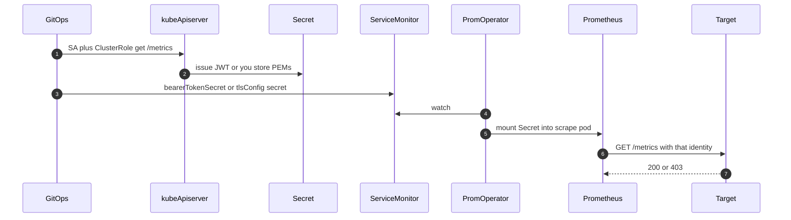

**Key:** 1–2 **you** create SA/RBAC (or copy etcd certs) · 3 SM **points** at a Secret · 4–5 Operator **injects** · 6 scrape. 403 = wrong issuer, not a missing SM.

| Identity | Who creates | Secret contains | SM field | Use when |
|----------|-------------|-----------------|----------|----------|
| Same-cluster kube token | You: SA + ClusterRole `get` `nonResourceURLs: ["/metrics"]` (or nodes/metrics). API fills Secret, or TokenRequest | `token` | `endpoints.bearerTokenSecret.name` + `key` | kube-apiserver, kubelet, KCM/scheduler if they trust **this** API |
| Prometheus’s own SA file | Chart/operator ServiceAccount | File in the Prom pod | `bearerTokenFile` | **Only** targets that trust that SA. Other API → **403** |
| etcd client cert | Bootstrap / Talos machine secrets / etcd PKI. **You** copy PEM into a Secret | `tls.crt` `tls.key` `ca.crt` | `tlsConfig` (`cert`, `keySecret`, `ca`) | etcd `:2379`. **Not** a kube JWT |
| None | — | — | omit auth | kube-proxy on localhost if it is open (rare in production) |

**Mount rule:** Prometheus must be allowed to read that Secret (Secret in the Prometheus namespace, or Operator RBAC `get` on the SM namespace). “secret not found” on the target is this rule, not PromQL.

**GitOps owns rotation:** recreate the Secret (new TokenRequest or new PEMs); Operator remounts; do not bake tokens into the SM YAML.

### When the component is not a Pod (binary on the node)

Talos (and some kubeadm static processes) run etcd, kube-apiserver, KCM, scheduler as **host processes**, not objects Alloy’s kubernetes discovery can list. ServiceMonitor **pod** SD then finds nothing. Default Alloy pod tail finds nothing.

**Metrics — you still need a target address**

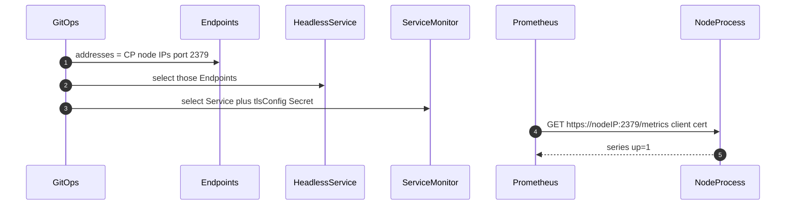

**Key:** 1 Endpoints = **node IPs**, not a Pod IP · 2–3 SM still works · 4 scrape the **process**. Same pattern for KCM `:10257` / scheduler `:10259` if they bind more than localhost (or use kubelet proxy).

| Pull | How |
|------|-----|
| Target | `Service` + `Endpoints`/`EndpointSlice` with control-plane **node IPs** and the metrics port. Or a Probe/static scrape. Not `role: pod` |
| Auth | etcd: client cert Secret. API/kubelet: SA token as above |
| Localhost-only bind | Process is not reachable from the Prom pod. Bind a reachable address, use a node-local exporter, or kubelet authenticated proxy — do not scrape 10252 |

**Logs — kubernetes discovery is the wrong tool**

```mermaid
sequenceDiagram
  autonumber
  participant Alloy as AlloyDS
  participant OS as JournalOrFile
  participant Proc as NodeProcess
  participant Loki as Loki
  Proc->>OS: write stdout / journal
  Alloy->>OS: read journal or hostPath file
  Note over Alloy,OS: Not loki.source.kubernetes. That lists Pods
  Alloy->>Alloy: label cluster job node
  Alloy->>Loki: push
```

**Key:** Alloy DaemonSet on **every CP node** · source = **journal** or **file** (hostPath) · Talos has no SSH journal like kubeadm — use **machine API logs** (`talosctl logs etcd` / a shipper that calls the machine API) or a file the OS exposes. Label `job=etcd` (or apiserver/KCM) by unit/file name, not by pod name.

| Push | How |
|------|-----|
| kubeadm static pod | Often still a mirror Pod in `kube-system` — kubernetes discovery **may** work |
| Binary / Talos service | `loki.source.journal` and/or `loki.source.file`. Privileged/hostPath as required. **Or** Talos machine-API log pipeline |
| Do not | Expect `loki.source.kubernetes` to see etcd on Talos |

If Alloy only uses kubernetes SD, **metrics can be `up=1` and Loki empty** for etcd. That is this gap, not a Loki outage.

Day-one SLO examples (tune, do not copy numbers blindly): etcd commit p99 above tens of ms on spinning disk; LIST p99 in seconds is already a stop-the-line signal; kubelet PLEG relist p99 climbing with NotReady.

| Signal | Why the line stops |
|--------|-------------------|
| etcd fsync / commit p99 | Disk too slow; elections will not fix it |
| etcd members / leader | Below quorum: API writes stall |
| apiserver LIST p99 | Unpaged LIST; Ready stays true |
| apiserver 5xx / terminations | Timeouts; clients retry and make it worse |
| KCM workqueue | Controllers behind; objects lie in `kubectl` |
| scheduler pending vs attempts | Placement stuck or kubelet/CNI blame |
| kubelet PLEG / runtime errors | Node cannot run pods |

## Decisions

| Topic | Default | Change when |
|-------|---------|-------------|
| Multi-tenant | One Grafana org; labels `cluster` `namespace` `team` | Legal isolation → separate stores |
| Retention | Logs 7–14d Loki; metrics ~15d local Prom | Longer → object storage; many clusters / cardinality → **Mimir** |
| Storage health | Dedicated PVCs; alert 70/85% and `up=0` | emptyDir/hostPath for the store (do not) |
| Auth | Scrape SA; Grafana SSO; no anonymous | Break-glass admin, audited |
| Encryption | TLS in transit; at-rest = disk/storage class | Extra keys when the class cannot |
| Redaction | Alloy drops tokens, JWTs, kubeconfig blobs | App still logs secrets → reject the stream |
| How to scrape kube | kube-prometheus SMs for kubelet + apiserver. **Not a Pod:** Service + Endpoints of **node IPs**. **Talos extra:** etcd TLS Secret; KCM/scheduler extra Service on **secure** port | Other distros: same jobs, their bind/TLS |
| Token into SM | GitOps: SA + RBAC; API issues JWT Secret; SM `bearerTokenSecret`; Operator mounts into Prom | `bearerTokenFile` only if the target trusts Prom’s own SA |
| etcd / host process logs | Alloy journal or file on CP nodes, or Talos machine-API shipper | kubernetes pod discovery if (and only if) a mirror Pod exists |
| Existing kube-prometheus jobs | **Reuse** kubelet/apiserver if `up`. Fill etcd / KCM / scheduler | Never a second SM for the same target |
| Trust domain | Token or cert issued by the **same** API you scrape | Extra API servers: separate SA |
| Port field | **Name** (`https`, `http`, `https-metrics`) | Number is ignored |
| Insecure metrics | Do not (no 10252) | Prefer 10257/10259 |
| Alerts day one | Factory mute + `up` per kube job + few SLOs (etcd quorum/disk, LIST p99, terminations, PLEG, scheduler pending) | Not a full kube-prometheus dump |
| Dashboards | One control-plane overview + drill-down | Teams do not need a custom board to see kubelet |
| Northbound | Grafana + Prom/Loki APIs | Pub/sub only if a bus already exists |

## Prove it

**Factory**

| Check | Pass |
|-------|------|
| Workloads | Prometheus, Loki, Grafana, Alloy DS, Alertmanager `Ready` |
| Metrics canary | Tiny Service + `ServiceMonitor`; `up{job="…canary"}==1` |
| Logs canary | One labeled line in Grafana Explore |
| Alert path | Test `PrometheusRule` hits the `team` receiver |
| Disk | PVC % below warn; alert not silenced |
| Auth | Unauthenticated GET to Prom/Loki fails; Grafana requires SSO |

If the canary needs a ticket, discovery is not the contract.

**Kube jobs** (after factory, or if factory already existed)

| Check | Pass |
|-------|------|
| `up{job="kube-apiserver",cluster="$c"}` | `1` |
| `up{job="etcd",cluster="$c"}` | = member count (e.g. 3) |
| `up{job="kube-controller-manager",cluster="$c"}` | `1` |
| `up{job="kube-scheduler",cluster="$c"}` | `1` |
| `up{job="kubelet",cluster="$c"}` | = Ready node count (cadvisor path also up) |
| `up{job="kube-proxy",cluster="$c"}` | `1` per node **or** skip documented |
| Alloy → Loki | Lines for apiserver, etcd, kubelet |
| Grafana | Control-plane overview loads; `$cluster` |

`/readyz` can stay **200** while LIST p99 is already bad. Standup line: members, LIST p99, terminations, PLEG — not “API is Ready.”

## When it breaks

| Failure | How you see it |
|---------|----------------|
| Silent scrape | `up==0`; SM selector mismatch |
| Loki falling behind | Ingester lag, WAL growth |
| PVC full | You should have alerted at 70/85% |
| Cardinality explosion | Series count / scrape duration / Prom OOM |
| SSO outage | Grafana dark; Prom/Loki still SRE-reachable |
| Alloy crashloop | DaemonSet not Ready; no new streams |
| **403 scrape** | Wrong API’s token. curl `/metrics` with the scrape JWT |
| **Job down** | Localhost / wrong port / x509 / secret not found |
| **etcd below quorum** | `up` count below majority; disk fsync p99. Do not restart all members |
| **Scheduler idle, pods Pending** | Often kubelet/CNI/quota — not a dead scheduler |
| **kubelet NotReady** | PLEG p99 / runtime errors; Loki kubelet |
| **Log gap** | Metrics up, Loki empty: Alloy filter, **or** process is not a Pod and kubernetes SD was used. Prove with a known apiserver/etcd line |
| **secret not found** | SM `bearerTokenSecret` / `tlsConfig` Secret not mountable by Prometheus |
| **KCM `up=1`, queues exploding** | Workqueue; apiserver 429/5xx |
| **cadvisor missing, kubelet up** | `/metrics/cadvisor` not in SM |

Mute of the **factory** pages platform on-call, not the app team.

## Beyond

Application telemetry, service mesh, and extra API servers are later **tenants of the same factory**. Same labels. CoreDNS: one SM, `job="coredns"`. Do not design product metrics here.

Many clusters: one Grafana + Thanos/Mimir, not copy-paste Prometheus. Cost is samples and log GB. Drop at Alloy / relabel.

## Worked example

Factory: ship Alloy DS, kube-prometheus-stack (or Operator + Prom + Alertmanager), Loki, Grafana SSO. Canary SM + one log line + test alert + PVC % below warn.

Kube jobs: reuse kubelet/apiserver SMs if `up`. Add etcd TLS, KCM/scheduler **secure** extra Service.

1. **Wrong trust domain** — SM `bearerTokenSecret` names a Secret the Operator mounts. Token must be issued by the **scraped** API. `bearerTokenFile` (Prom’s own SA) → 403 on any other API.
2. **`port` is a name** — Service `ports[].name` must match SM `endpoints.port`.
3. **Job collision** — always label `cluster`.
4. **Do not overwrite the app Service** — extra Service for KCM `:10257` (or Endpoints of node IPs if it is not a Pod).
5. **Prove `/metrics` on the API you scrape** — curl with **that** JWT; do not port-forward the wrong cluster.
6. **`/readyz` is not the SLO** — LIST p99, terminations, etcd fsync.

**Extra metrics Service** (Pod selector). If KCM is a node binary, drop `selector` and set `Endpoints` to CP node IPs.

```yaml
apiVersion: v1
kind: Service
metadata:
  name: kube-controller-manager-metrics
  namespace: kube-system
  labels:
    metrics-job: kube-controller-manager
spec:
  selector:
    k8s-app: kube-controller-manager
  ports:
    - name: https
      port: 10257
      targetPort: 10257
```

**ServiceMonitor** — Operator mounts `scrape-token`; scrape uses `port: https` (the **name**).

```yaml
apiVersion: monitoring.coreos.com/v1
kind: ServiceMonitor
metadata:
  name: kube-controller-manager
  namespace: monitoring
spec:
  jobLabel: metrics-job
  namespaceSelector:
    matchNames: [kube-system]
  selector:
    matchLabels:
      metrics-job: kube-controller-manager
  endpoints:
    - port: https
      path: /metrics
      scheme: https
      scrapeTimeout: 30s
      bearerTokenSecret:
        name: scrape-token
        key: token
      tlsConfig:
        ca:
          secret:
            name: kube-apiserver-ca
            key: ca.crt
```

The sample uses a trusted CA. Do not disable certificate verification in production. Scheduler is the same shape on **10259**. etcd uses `tlsConfig` cert/key/ca Secrets, not `bearerTokenSecret`.

**Prove the token** (expect `# HELP`, not 403):

```bash
TOKEN=$(kubectl -n monitoring get secret scrape-token -o jsonpath='{.data.token}' | base64 -d)
curl -sk -H "Authorization: Bearer ${TOKEN}" "https://${APISERVER_HOST}:6443/metrics" | head
```

**Alertmanager** — route on `owner` / `severity`. Dashboards are not the pager.

```yaml
route:
  receiver: default
  group_by: [alertname, component]
  routes:
    - matchers: [owner = platform]
      receiver: platform-oncall
    - matchers: [owner = payments, severity = critical]
      receiver: payments-pager
    - matchers: [owner = payments]
      receiver: payments-chat
```

Live Grafana/Prometheus **screenshots** are site photos, not architecture — capture `up` by job in your own Grafana when you prove.

### Done checklist

- [ ] Factory Ready (Prom, Loki, Grafana, Alloy, Alertmanager)
- [ ] Canary SM `up=1` + canary log + test alert
- [ ] Six jobs (or five + documented no kube-proxy) `up` with `cluster`
- [ ] etcd TLS; KCM/scheduler on **secure** ports
- [ ] Alloy: apiserver, etcd, kubelet (at least)
- [ ] Alerts: factory mute + `up` + etcd quorum/disk + LIST/terminations + PLEG
- [ ] Grafana control-plane overview
- [ ] Scrape JWT or etcd PEMs live in a Secret the Operator can mount; 403 with the wrong issuer once on purpose

---

*Repo manifests are an implementation footnote, not the product.*
