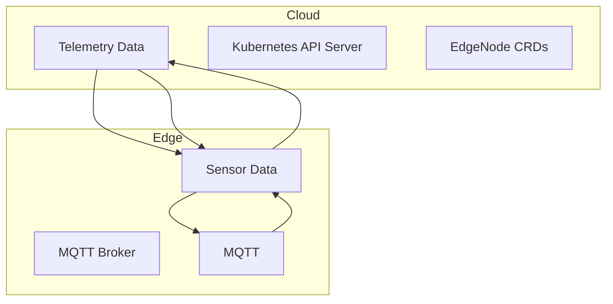
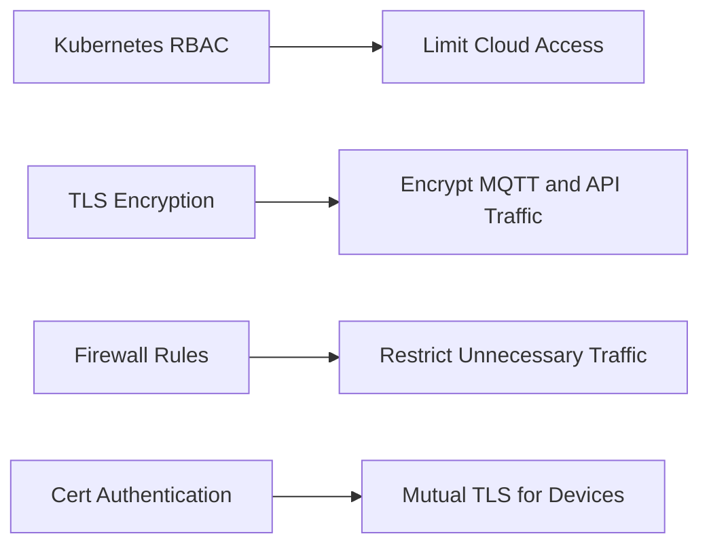
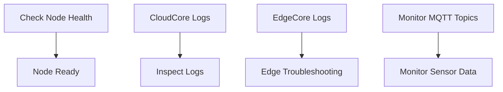

# Project #1: KubeEdge – Extending Kubernetes to the Edge

## Overview

This document is designed to help present KubeEdge to clients as a powerful extension of Kubernetes for edge computing scenarios. It includes:

- Introduction & Purpose
- Architecture & Components (with diagrams)
- Installation & Setup (placeholder)
- Deploying Edge Applications (placeholder)
- Device Management & IoT Integration (placeholder)
- Security Best Practices
- Monitoring & Troubleshooting
- Final Thoughts

---

## 🌐 Introduction

Kubernetes is the de facto orchestration platform for cloud-native applications but is primarily optimized for centralized cloud and data center deployments.

**KubeEdge** extends Kubernetes to edge environments, enabling workloads to run closer to data sources (e.g., sensors, IoT devices, gateways).

### Why Use KubeEdge?

- ✅ Run workloads on edge devices with Kubernetes APIs
- ✅ Reduce latency and enable real-time decision-making
- ✅ Operate edge nodes in offline or intermittent-connectivity scenarios
- ✅ Centralized control plane with decentralized execution

### Use Cases

- **Smart Cities 🚦**: Traffic analysis, pollution monitoring
- **Industrial IoT 🏭**: Predictive maintenance, machine control
- **Retail 🛒**: Smart POS, inventory analytics
- **Healthcare 🏥**: Remote monitoring, edge diagnostics

---

## 🛠️ Architecture & Components

### High-Level Diagram



---

### ☁️ Cloud Side - CloudCore

- Runs in Kubernetes cluster (cloud or data center)
- Manages edge nodes via CRDs
- Facilitates cloud-to-edge and edge-to-cloud synchronization

### 💻 Edge Side - EdgeCore

- Runs on edge hardware (e.g., Raspberry Pi, Industrial PCs)
- Handles local processing and device communication
- Functions autonomously during network interruptions

---

## 🔐 Security Best Practices



### Recommendations

- ✅ Apply **Kubernetes RBAC** to enforce least-privilege access
- ✅ Enable **TLS** between CloudCore ↔ EdgeCore and MQTT
- ✅ Harden network with **firewall rules** around edge ports
- ✅ Use **certificate-based device authentication** (x.509)

---

## ⚖️ Monitoring & Troubleshooting



### Key Commands

Check edge node status:

```bash
kubectl get nodes
```

View CloudCore logs:

```bash
kubectl logs -n kubeedge -l app=cloudcore
```

Debug EdgeCore locally:

```bash
journalctl -u edgecore -f
```

Monitor MQTT messages:

```bash
mosquitto_sub -h <edge-node-ip> -t "sensor/temperature"
```

---

## 💡 Final Thoughts

**KubeEdge** enables Kubernetes to power edge computing, offering:

- ✅ **Offline Resilience**: Edge devices work even when disconnected
- ✅ **Real-time Processing**: Low-latency decision-making on-device
- ✅ **Centralized Control**: Operate thousands of edge nodes from a single Kubernetes cluster

**Ideal for**: IoT, manufacturing, healthcare, smart infrastructure, and more.

---
