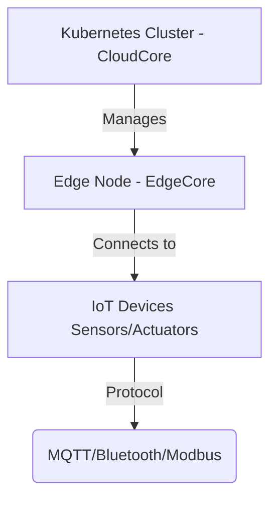

# Project 1: KubeEdge – Extending Kubernetes to the Edge

## This guide will cover:
- ✅ Introduction & Purpose
- ✅ Architecture & Components
- ✅ Installation & Setup
- ✅ Deploying Edge Applications
- ✅ Device Management & IoT Integration
- ✅ Security Best Practices
- ✅ Monitoring & Troubleshooting

---

## 🧭 Introduction
Kubernetes is powerful, but it was designed for cloud and data centers.  
**KubeEdge** extends Kubernetes to edge computing environments, allowing applications to run on edge nodes (e.g., IoT devices, industrial sensors, retail systems).

### Why Use KubeEdge?
- ✅ Brings Kubernetes to edge devices for real-time processing
- ✅ Reduces cloud dependency and latency
- ✅ Works offline – edge devices keep running even if disconnected
- ✅ Seamless Kubernetes integration for managing edge workloads

### Use Cases
- 🚦 **Smart Cities**: Traffic monitoring, environmental sensors
- 🏭 **Industrial IoT**: Machine data collection, predictive maintenance
- 🛒 **Retail**: Smart checkout systems, in-store analytics
- 🏥 **Healthcare**: Remote patient monitoring

---

## 🧱 KubeEdge Architecture


### Cloud Side (**CloudCore**)
- Runs in a Kubernetes cluster (public cloud, private data center)
- Manages edge nodes using custom CRDs (Custom Resource Definitions)
- Syncs workloads between cloud and edge

### Edge Side (**EdgeCore**)
- Runs on edge devices (Raspberry Pi, industrial gateways, on-prem servers)
- Processes data locally to reduce cloud traffic
- Manages devices connected via Bluetooth, MQTT, or Modbus
- 

## ⚙️ Installing KubeEdge

### Step 1: Install Kubernetes on the Cloud
```bash
curl -LO https://storage.googleapis.com/kubernetes-release/release/$(curl -s https://storage.googleapis.com/kubernetes-release/release/stable.txt)/bin/linux/amd64/kubectl
chmod +x kubectl && sudo mv kubectl /usr/local/bin/
kubectl version --client
```

### Step 2: Install CloudCore
```bash
wget https://github.com/kubeedge/kubeedge/releases/download/v1.12.0/keadm-v1.12.0-linux-amd64.tar.gz
tar -xvzf keadm-*.tar.gz && sudo mv keadm /usr/local/bin/
keadm init --advertise-address="<Cloud Public IP>"
kubectl get pods -n kubeedge
```

### Step 3: Install EdgeCore on Edge Node
```bash
wget https://github.com/kubeedge/kubeedge/releases/download/v1.12.0/keadm-v1.12.0-linux-arm64.tar.gz
tar -xvzf keadm-*.tar.gz && sudo mv keadm /usr/local/bin/
keadm join --cloudcore-ip=<Cloud Public IP>
kubectl get nodes
```

---

## 🚀 Deploying Applications to Edge Nodes

### Step 1: Nginx Deployment YAML
```yaml
apiVersion: apps/v1
kind: Deployment
metadata:
  name: edge-nginx
spec:
  selector:
    matchLabels:
      app: nginx
  template:
    metadata:
      labels:
        app: nginx
    spec:
      nodeSelector:
        node-role.kubernetes.io/edge: "true"
      containers:
        - name: nginx
          image: nginx:latest
          ports:
            - containerPort: 80
```

### Step 2: Expose via NodePort
```yaml
apiVersion: v1
kind: Service
metadata:
  name: edge-nginx-service
spec:
  type: NodePort
  selector:
    app: nginx
  ports:
    - protocol: TCP
      port: 80
      nodePort: 30080
```

Access via: `http://<EdgeNode_IP>:30080`

---

## 🔗 Device Management & IoT Integration

### Step 1: MQTT Broker Deployment
```yaml
apiVersion: apps/v1
kind: Deployment
metadata:
  name: mosquitto
spec:
  selector:
    matchLabels:
      app: mosquitto
  template:
    metadata:
      labels:
        app: mosquitto
    spec:
      containers:
        - name: mosquitto
          image: eclipse-mosquitto:latest
          ports:
            - containerPort: 1883
```

### Step 2: IoT Device Publishing via MQTT
```python
import paho.mqtt.client as mqtt

client = mqtt.Client()
client.connect("edge-node-ip", 1883, 60)
client.publish("sensor/temperature", "23.5")
```

---

## 🔐 Security Best Practices

- ✅ Use Kubernetes RBAC to limit access to edge nodes
- ✅ Enable TLS encryption for MQTT and API communication
- ✅ Configure firewall rules to protect edge devices
- ✅ Ensure secure device authentication using certificates
  


---

## 🔍 Monitoring & Troubleshooting


### 1. Check Edge Node Connectivity
```bash
kubectl get nodes
```

### 2. CloudCore Logs
```bash
kubectl logs -n kubeedge -l app=cloudcore
```

### 3. EdgeCore Logs (on Edge Node)
```bash
journalctl -u edgecore -f
```

### 4. Monitor MQTT Messages
```bash
mosquitto_sub -h edge-node-ip -t "sensor/temperature"
```

---

## 🧠 Final Thoughts

**KubeEdge brings Kubernetes to the edge**, enabling:
- ✅ Offline edge computing (devices function without internet)
- ✅ Low-latency data processing at the source
- ✅ Scalability to thousands of edge nodes

**Ideal for:** IoT, Smart Cities, Industrial Automation, Retail, and Healthcare.
