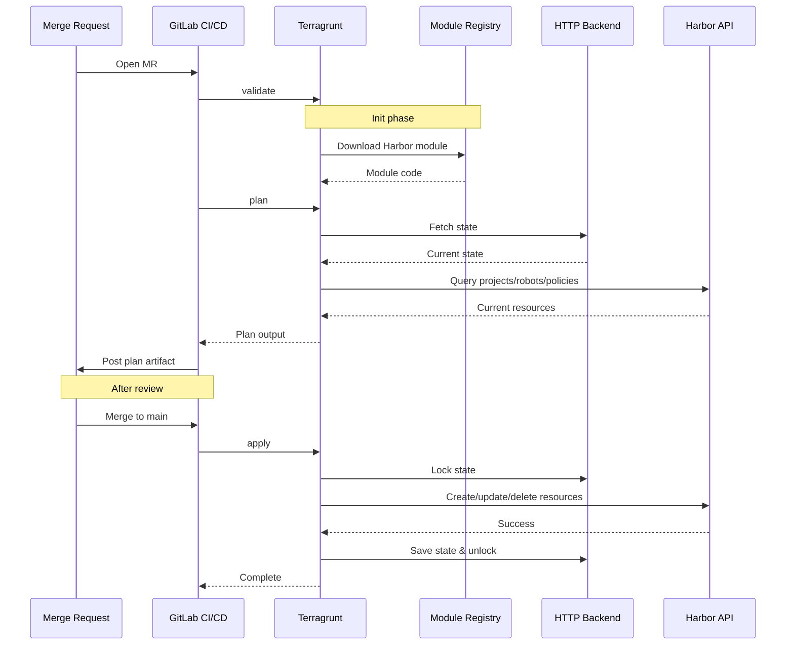

# Harbor Infrastructure as Code (IaC) Implementation

Automate Harbor container registry management using the **goharbor/harbor** Terraform provider with Terragrunt and GitLab CI/CD.

> **📚 New to Terraform/Terragrunt?** See [TERRAFORM_GUIDE.md](https://github.com/naren4b/nks/blob/main/docs/tg-tf-gl.md)for setup instructions, module creation, GitLab backend configuration, and CI/CD pipeline patterns.

---

## Table of Contents

| Section | Purpose |
|---------|---------|
| [1. Overview](#1-overview) | Project introduction |
| [2. Prerequisites](#2-prerequisites) | Harbor-specific requirements |
| [3. Project Structure](#3-project-structure) | Directory layout |
| [4. Harbor Provider Setup](#4-harbor-provider-setup) | Provider configuration |
| [5. Harbor Module Structure](#5-harbor-module-structure) | Custom module details |
| [6. Configuration](#6-configuration) | Variables and settings |
| [7. Usage Examples](#7-usage-examples) | How to use the module |
| [8. Migration Guide](#8-migration-guide) | Import existing resources |
| [9. Environment Variables](#9-environment-variables) | Required credentials |
| [10. CI/CD Pipeline](#10-cicd-pipeline) | Harbor-specific pipeline |
| [11. Troubleshooting](#11-troubleshooting) | Common issues |

---

## 1. Overview

This project provides Infrastructure as Code for Harbor registry management:

**Features:**
- **Project Management** - Create and configure Harbor projects
- **Robot Accounts** - Automated service accounts with scoped permissions
- **Retention Policies** - Automatic image cleanup based on rules
- **Replication** - Mirror images to target registries
- **GitLab Integration** - State backend, module registry, CI/CD

**Architecture:**

```
┌─────────────────┐     ┌──────────────────┐     ┌─────────────────┐
│  Terragrunt     │────▶│  Harbor Module   │────▶│  Harbor API     │
│  Orchestration  │     │  (Custom)        │     │  (Provider)     │
└─────────────────┘     └──────────────────┘     └─────────────────┘
        │                       │
        │                       ▼
        │               ┌──────────────────┐
        │               │  - Projects      │
        │               │  - Robot Accounts│
        │               │  - Retention     │
        │               │  - Replication   │
        │               └──────────────────┘
        ▼
┌─────────────────┐
│  GitLab State   │
│  Backend        │
└─────────────────┘
```

---

## 2. Prerequisites

### General Prerequisites

See [TERRAFORM_GUIDE.md - Prerequisites](TERRAFORM_GUIDE.md#1-prerequisites) for:
- Terraform/OpenTofu installation
- Terragrunt installation
- GitLab setup

### Harbor-Specific Prerequisites

- **Harbor Instance** - Access to Harbor registry (v2.x+)
- **Harbor Admin Credentials** - Username and password/token
- **Harbor Provider** - `goharbor/harbor` (installed automatically)
- **jq** - For migration scripts

**Provider Documentation:**
- [Harbor Provider - Terraform Registry](https://registry.terraform.io/providers/goharbor/harbor/latest/docs)
- [Harbor Provider - GitHub](https://github.com/goharbor/terraform-provider-harbor)

---

## 3. Project Structure

```
harbor-tf/
├── README.md                          # This file
├── dev.env                            # Optional local environment setup
├── environments/
│   ├── root.hcl                       # Shared Terragrunt config
│   └── dev/
│       ├── terragrunt.hcl             # Environment-specific config
│       └── terraform.tfvars           # Harbor project definitions
├── migration/
│   ├── project-migration.sh           # Import existing projects
│   ├── robot-account-migration.sh     # Import robot accounts
│   └── statefile-migration.sh         # Migrate state between environments
└── .gitlab-ci.yml                     # CI/CD pipeline (optional)
```

---

## 4. Harbor Provider Setup

### Provider Configuration

The Harbor provider is configured in `environments/root.hcl`:

```hcl
# environments/root.hcl

locals {
  env_name        = basename(get_terragrunt_dir())
  harbor_username = get_env("HARBOR_USERNAME_${local.env_name}", get_env("HARBOR_USERNAME")) 
  harbor_password = get_env("HARBOR_PASSWORD_${local.env_name}", get_env("HARBOR_PASSWORD")) 
  harbor_url      = get_env("HARBOR_URL_${local.env_name}", get_env("HARBOR_URL"))
}

generate "providers" {
  path      = "providers.tf"
  if_exists = "overwrite_terragrunt"
  contents  = <<EOF
provider "harbor" {
  url      = "${local.harbor_url}"
  username = "${local.harbor_username}"
  password = "${local.harbor_password}"
  insecure = var.registry["insecure"]  # Set to true for self-signed certs
}
EOF
}
```

### Provider Version Pinning

In your module's `versions.tf`:

```hcl
terraform {
  required_version = ">= 1.3"
  
  required_providers {
    harbor = {
      source  = "goharbor/harbor"
      version = "~> 3.10"  # Pin to stable version
    }
  }
}
```

### Provider Authentication

Harbor provider supports multiple authentication methods:

1. **Environment Variables** (Recommended):
   ```bash
   export HARBOR_URL='https://harbor.example.com'
   export HARBOR_USERNAME='admin'
   export HARBOR_PASSWORD='your-password'
   ```

2. **Provider Block** (Generated by Terragrunt):
   ```hcl
   provider "harbor" {
     url      = "https://harbor.example.com"
     username = "admin"
     password = "your-password"
     insecure = true  # For self-signed certificates
   }
   ```

3. **Per-Environment** (Using Terragrunt locals):
   ```bash
   export HARBOR_USERNAME_dev='dev-admin'
   export HARBOR_PASSWORD_dev='dev-password'
   ```

---

## 5. Harbor Module Structure

### Module Components

The Harbor custom module is organized by resource type:

```
modules/harbor/
├── main.tf                # Data sources (registry lookup)
├── variables.tf           # Input variable definitions
├── output.tf              # Output definitions
├── project.tf             # Harbor project resources
├── robot_account.tf       # Robot account resources
├── retention_policy.tf    # Retention policy resources
├── replication.tf         # Replication resources
└── versions.tf            # Provider version requirements
```

### Key Resources

**1. Harbor Project (`harbor_project`)**

Creates container registry projects:

```hcl
resource "harbor_project" "main" {
  for_each = var.projects
  name     = each.key
  
  # Project settings
  public             = false
  vulnerability_scanning = true
  
  # Metadata
  metadata = {
    ticket_number = each.value.ticket_number
    project_owner = each.value.project_owner
  }
}
```

**2. Robot Account (`harbor_robot_account`)**

Creates service accounts for CI/CD:

```hcl
resource "harbor_robot_account" "main" {
  for_each    = { for k, v in var.projects : k => v if v.robot_accounts != null }
  
  name        = "${each.key}-robot"
  description = "Robot account for ${each.key}"
  level       = "project"
  
  permissions {
    kind      = "project"
    namespace = harbor_project.main[each.key].name
    
    access {
      action   = "pull"
      resource = "repository"
    }
    
    access {
      action   = "push"
      resource = "repository"
    }
  }
}
```

**3. Retention Policy (`harbor_retention_policy`)**

Automates image cleanup:

```hcl
resource "harbor_retention_policy" "main" {
  for_each = { for k, v in var.projects : k => v if v.retention_policy.enable }
  
  scope    = harbor_project.main[each.key].id
  schedule = each.value.retention_policy.schedule
  
  dynamic "rule" {
    for_each = each.value.retention_policy.rules
    content {
      n_days_since_last_pull = rule.value.n_days_since_last_pull
      repo_matching          = rule.value.repo_matching
      tag_matching           = rule.value.tag_matching
    }
  }
}
```

**4. Replication (`harbor_replication`)**

Mirrors images to target registries:

```hcl
resource "harbor_replication" "main" {
  for_each = { for k, v in var.projects : k => v if v.replication.enable }
  
  name        = "${each.key}-replication"
  action      = "push"
  registry_id = data.harbor_registry.main[var.replication_registry_name].id
  
  dynamic "filters" {
    for_each = each.value.replication.filters_by_name
    content {
      type  = "name"
      value = filters.value
    }
  }
}
```

### Data Sources

**Registry Lookup:**

```hcl
data "harbor_registry" "main" {
  for_each = try(toset(var.registry.harbor_registry), [])
  name     = each.value
}
```

### Module Variables

**Key Variables:**

```hcl
variable "registry" {
  description = "Harbor registry connection info"
  type = object({
    insecure        = optional(bool)
    harbor_registry = optional(list(string))
  })
}

variable "projects" {
  description = "Map of project definitions"
  type = map(object({
    ticket_number  = string
    project_owner  = string
    robot_accounts = optional(map(list(string)))
    replication = object({
      enable          = bool
      filters_by_name = optional(list(string))
      filters_by_tag  = optional(list(string))
    })
    retention_policy = object({
      enable   = bool
      schedule = optional(string)
      rules = list(object({
        n_days_since_last_pull = optional(number)
        repo_matching          = optional(string)
        tag_matching           = optional(string)
      }))
    })
  }))
}
```

### Module Outputs

```hcl
output "project_details" {
  value = {
    for k, m in harbor_project.main : k => {
      project_id = m.project_id
      name       = m.name
    }
  }
  description = "Project metadata"
}

output "robot_account_secrets" {
  value = {
    for k, r in harbor_robot_account.main : k => {
      name   = r.name
      secret = r.secret
    }
  }
  description = "Robot account credentials"
  sensitive   = true
}
```

---

## 6. Configuration

### Environment Variables

**Required for Harbor Provider:**

```bash
# Harbor API endpoint
export HARBOR_URL='https://harbor.example.com'

# Harbor admin credentials
export HARBOR_USERNAME='admin'
export HARBOR_PASSWORD='your-password'

# Per-environment (optional)
export HARBOR_URL_dev='https://harbor-dev.example.com'
export HARBOR_USERNAME_dev='dev-admin'
export HARBOR_PASSWORD_dev='dev-password'
```

**Required for GitLab Backend:**

See [TERRAFORM_GUIDE.md - GitLab Remote Backend](TERRAFORM_GUIDE.md#4-gitlab-remote-backend)

```bash
export TF_HTTP_USERNAME='<gitlab-username>'
export TF_HTTP_PASSWORD='<gitlab-token>'
export CI_API_V4_URL='https://<gitlab-host>/api/v4'
export CI_SERVER_HOST='<gitlab-host>'
export CI_PROJECT_ID='<project-id>'
```

**Required for Module Registry:**

```bash
export GITLAB_HARBOR_MODULE_SOURCE='<gitlab-host>/<group>/<repo>.git'
export GITLAB_HARBOR_MODULE_PATH='modules/harbor'
export GITLAB_HARBOR_MODULE_VERSION='v1.0.0'
```

### Project Configuration

**terraform.tfvars:**

```hcl
registry = {
  insecure        = true  # Set to false for production with valid certs
  harbor_registry = ["target-registry"]  # For replication
}

projects = {
  my-app = {
    ticket_number  = "TICKET-123"
    project_owner  = "platform-team"
    
    robot_accounts = {
      ci = ["pull", "push"]
    }
    
    replication = {
      enable          = true
      filters_by_name = ["my-app/**"]
      filters_by_tag  = ["v*", "latest"]
    }
    
    retention_policy = {
      enable   = true
      schedule = "0 0 * * *"  # Daily at midnight
      rules = [
        {
          n_days_since_last_pull = 30
          repo_matching          = "**"
          tag_matching           = "v*"
        }
      ]
    }
  }
}
```

---

## 7. Usage Examples

### Basic Project Creation

```hcl
projects = {
  simple-project = {
    ticket_number  = "JIRA-456"
    project_owner  = "team-alpha"
    robot_accounts = null
    replication = {
      enable = false
    }
    retention_policy = {
      enable = false
      rules  = []
    }
  }
}
```

### Project with Robot Account

```hcl
projects = {
  ci-project = {
    ticket_number  = "JIRA-789"
    project_owner  = "team-beta"
    
    robot_accounts = {
      puller = ["pull"]
      pusher = ["pull", "push"]
    }
    
    replication = {
      enable = false
    }
    retention_policy = {
      enable = false
      rules  = []
    }
  }
}
```

### Project with Retention Policy

```hcl
projects = {
  production-app = {
    ticket_number  = "JIRA-101"
    project_owner  = "team-gamma"
    robot_accounts = null
    replication = {
      enable = false
    }
    
    retention_policy = {
      enable   = true
      schedule = "0 2 * * 0"  # Weekly on Sunday at 2 AM
      rules = [
        {
          # Keep images pulled in last 90 days
          n_days_since_last_pull = 90
          repo_matching          = "**"
          tag_matching           = "v*"
        },
        {
          # Keep latest 10 images
          n_days_since_last_pull = null
          repo_matching          = "**"
          tag_matching           = "latest"
        }
      ]
    }
  }
}
```

### Project with Replication

```hcl
projects = {
  replicated-app = {
    ticket_number  = "JIRA-202"
    project_owner  = "team-delta"
    robot_accounts = null
    
    replication = {
      enable          = true
      filters_by_name = ["replicated-app/**"]
      filters_by_tag  = ["v*", "stable"]
    }
    
    retention_policy = {
      enable = false
      rules  = []
    }
  }
}
```

### Running Terragrunt

```bash
# Navigate to environment
cd environments/dev

# Initialize
terragrunt init

# Plan changes
terragrunt plan

# Apply changes
terragrunt apply

# View outputs
terragrunt output

# View robot account secrets
terragrunt output -json robot_account_secrets | jq
```

---

## 8. Migration Guide

### Importing Existing Harbor Resources

Use the migration scripts to import existing Harbor projects into Terraform state.

### Prerequisites

```bash
# Set Harbor credentials
export HARBOR_URL='https://harbor.example.com'
export HARBOR_USERNAME='admin'
export HARBOR_PASSWORD='your-password'

# Install jq
sudo apt-get install jq  # Ubuntu/Debian
brew install jq          # macOS
```

### Step 1: Add Project to Configuration

Add the existing project to `terraform.tfvars`:

```hcl
projects = {
  existing-project = {
    ticket_number  = "TICKET-999"
    project_owner  = "legacy-team"
    robot_accounts = {
      ci = ["pull", "push"]
    }
    replication = {
      enable = false
    }
    retention_policy = {
      enable = false
      rules  = []
    }
  }
}
```

### Step 2: Run Migration Script

```bash
cd migration
./project-migration.sh environments/dev existing-project
```

The script will:
1. Fetch project ID from Harbor API
2. Import `harbor_project.main["existing-project"]`
3. Import robot accounts
4. Import retention policies
5. Import replication policies

### Step 3: Verify State

```bash
cd environments/dev
terragrunt state list

# Should show:
# harbor_project.main["existing-project"]
# harbor_robot_account.main["existing-project"]
# ...
```

### Step 4: Regenerate Robot Secrets

Imported robot accounts have `null` secrets (Harbor API doesn't expose them):

```bash
terragrunt apply -replace='harbor_robot_account.main["existing-project"]'

# View new secret
terragrunt output -json robot_account_secrets | jq '.["existing-project"]'
```

### Manual Import

```bash
cd environments/dev

# Get project ID
PROJECT_ID=$(curl -s -k -u "${HARBOR_USERNAME}:${HARBOR_PASSWORD}" \
  "${HARBOR_URL}/api/v2.0/projects?name=existing-project" | jq -r '.[0].project_id')

# Import project
terragrunt import 'harbor_project.main["existing-project"]' /projects/${PROJECT_ID}

# Get robot ID
ROBOT_ID=$(curl -s -k -u "${HARBOR_USERNAME}:${HARBOR_PASSWORD}" \
  "${HARBOR_URL}/api/v2.0/robots?q=Level%3Dproject%2CProjectID%3D${PROJECT_ID}&page_size=100" \
  | jq -r '.[0].id')

# Import robot account
terragrunt import 'harbor_robot_account.main["existing-project"]' /robots/${ROBOT_ID}
```

---

## 9. Environment Variables

### Summary Table

| Variable | Purpose | Example | Required |
|----------|---------|---------|----------|
| `HARBOR_URL` | Harbor API endpoint | `https://harbor.example.com` | Yes |
| `HARBOR_USERNAME` | Harbor admin user | `admin` | Yes |
| `HARBOR_PASSWORD` | Harbor admin password | `your-password` | Yes |
| `TF_HTTP_USERNAME` | GitLab username | `gitlab-user` | Yes (for backend) |
| `TF_HTTP_PASSWORD` | GitLab token | `glpat-xxx` | Yes (for backend) |
| `CI_API_V4_URL` | GitLab API URL | `https://gitlab.com/api/v4` | Yes (for backend) |
| `CI_SERVER_HOST` | GitLab host | `gitlab.example.com` | Yes (for backend) |
| `CI_PROJECT_ID` | GitLab project ID | `12345` | Yes (for backend) |

### Local Development Setup

```bash
# Create .env file (add to .gitignore!)
cat > dev.env <<EOF
# Harbor
export HARBOR_URL='https://harbor.example.com'
export HARBOR_USERNAME='admin'
export HARBOR_PASSWORD='your-password'

# GitLab Backend
export TF_HTTP_USERNAME='gitlab-user'
export TF_HTTP_PASSWORD='glpat-xxx'
export CI_API_V4_URL='https://gitlab.example.com/api/v4'
export CI_SERVER_HOST='gitlab.example.com'
export CI_PROJECT_ID='12345'

# OpenTofu
export TG_TF_PATH=tofu
EOF

# Source before running
source dev.env
cd environments/dev
terragrunt init
```

### CI/CD Variables

Set in GitLab Project → Settings → CI/CD → Variables:

- `HARBOR_URL` (Masked)
- `HARBOR_USERNAME` (Masked)
- `HARBOR_PASSWORD` (Masked, Protected)
- `TF_HTTP_USERNAME` (Masked)
- `TF_HTTP_PASSWORD` (Masked, Protected)

---

## 10. CI/CD Pipeline

For general CI/CD pipeline setup, see [TERRAFORM_GUIDE.md - CI/CD Pipeline Setup](TERRAFORM_GUIDE.md#8-cicd-pipeline-setup).

### Harbor-Specific Pipeline

`.gitlab-ci.yml`:

```yaml
stages:
  - validate
  - plan
  - apply

variables:
  TG_VERSION: "0.55.0"

.terragrunt:
  image: alpine/terragrunt:${TG_VERSION}
  before_script:
    - cd environments/${ENVIRONMENT}

# Validate Harbor configuration
validate:
  extends: .terragrunt
  stage: validate
  parallel:
    matrix:
      - ENVIRONMENT: [dev, staging, prod]
  script:
    - terragrunt validate
  rules:
    - if: $CI_PIPELINE_SOURCE == "merge_request_event"
    - if: $CI_COMMIT_BRANCH == $CI_DEFAULT_BRANCH

# Plan Harbor changes
plan:
  extends: .terragrunt
  stage: plan
  parallel:
    matrix:
      - ENVIRONMENT: [dev, staging, prod]
  script:
    - terragrunt init
    - terragrunt plan -out=plan.tfplan | tee plan.txt
  artifacts:
    paths:
      - environments/${ENVIRONMENT}/plan.tfplan
      - environments/${ENVIRONMENT}/plan.txt
    expire_in: 1 week
  rules:
    - if: $CI_PIPELINE_SOURCE == "merge_request_event"

# Apply to dev (auto)
apply:dev:
  extends: .terragrunt
  stage: apply
  variables:
    ENVIRONMENT: dev
  script:
    - terragrunt init
    - terragrunt apply -auto-approve
  environment:
    name: dev
  rules:
    - if: $CI_COMMIT_BRANCH == $CI_DEFAULT_BRANCH

# Apply to prod (manual)
apply:prod:
  extends: .terragrunt
  stage: apply
  variables:
    ENVIRONMENT: prod
  script:
    - terragrunt init
    - terragrunt apply -auto-approve
  environment:
    name: prod
  rules:
    - if: $CI_COMMIT_BRANCH == $CI_DEFAULT_BRANCH
      when: manual
```

### Pipeline Sequence



---

## 11. Troubleshooting

### Harbor Provider Issues

**Authentication Failures:**

```bash
# Test Harbor API access
curl -u "${HARBOR_USERNAME}:${HARBOR_PASSWORD}" \
  "${HARBOR_URL}/api/v2.0/projects"

# Check credentials
echo $HARBOR_URL
echo $HARBOR_USERNAME
echo $HARBOR_PASSWORD  # Be careful with this in shared environments!
```

**Certificate Issues:**

```hcl
# For self-signed certificates
provider "harbor" {
  insecure = true
}
```

**Provider Version Issues:**

```bash
# Clear provider cache
rm -rf .terraform .terragrunt-cache
terragrunt init -upgrade
```

### Robot Account Issues

**Null Secrets After Import:**

```bash
# Recreate robot account to get new secret
terragrunt apply -replace='harbor_robot_account.main["project-name"]'

# View secret
terragrunt output -json robot_account_secrets | jq '.["project-name"]'
```

**Permission Errors:**

Ensure robot account has correct permissions in project settings.

### Replication Issues

**Registry Not Found:**

```bash
# List available registries
curl -u "${HARBOR_USERNAME}:${HARBOR_PASSWORD}" \
  "${HARBOR_URL}/api/v2.0/registries"

# Verify registry name in terraform.tfvars
```

**Replication Not Triggering:**

Check replication policy filters match your image names and tags.

### State Lock Issues

See [TERRAFORM_GUIDE.md - State Management](TERRAFORM_GUIDE.md#5-state-management)

```bash
# Force unlock if stuck
terragrunt force-unlock <LOCK_ID>
```

### General Debugging

```bash
# Enable debug logging
export TF_LOG=DEBUG
export TG_LOG=DEBUG

# Run with verbose output
terragrunt plan --terragrunt-log-level debug
```

---

## References

### Harbor Provider

- [Harbor Provider Documentation](https://registry.terraform.io/providers/goharbor/harbor/latest/docs)
- [Harbor Provider GitHub](https://github.com/goharbor/terraform-provider-harbor)
- [Harbor API Documentation](https://github.com/goharbor/harbor/blob/main/docs/README.md)

### Generic Guides

- [Terraform/Terragrunt Setup Guide](TERRAFORM_GUIDE.md)
- [GitLab Terraform Integration](https://docs.gitlab.com/ee/user/infrastructure/iac/)

---

## Contributing

When adding new features:

1. Update `terraform.tfvars` with new project definitions
2. Run `terragrunt plan` to preview changes
3. Create merge request with plan output
4. Review and approve changes
5. Merge to trigger apply

---

## License

This project is for infrastructure automation.
