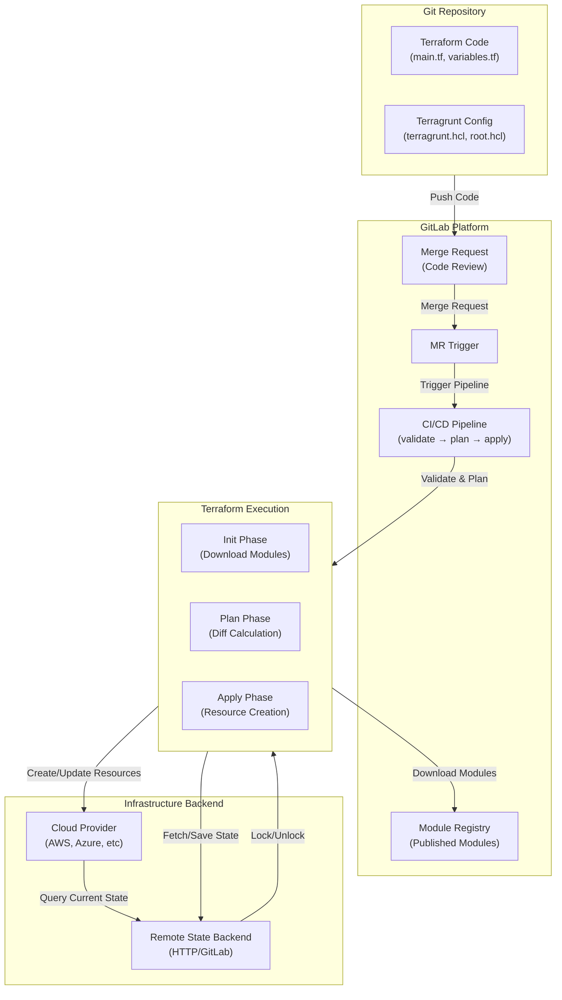
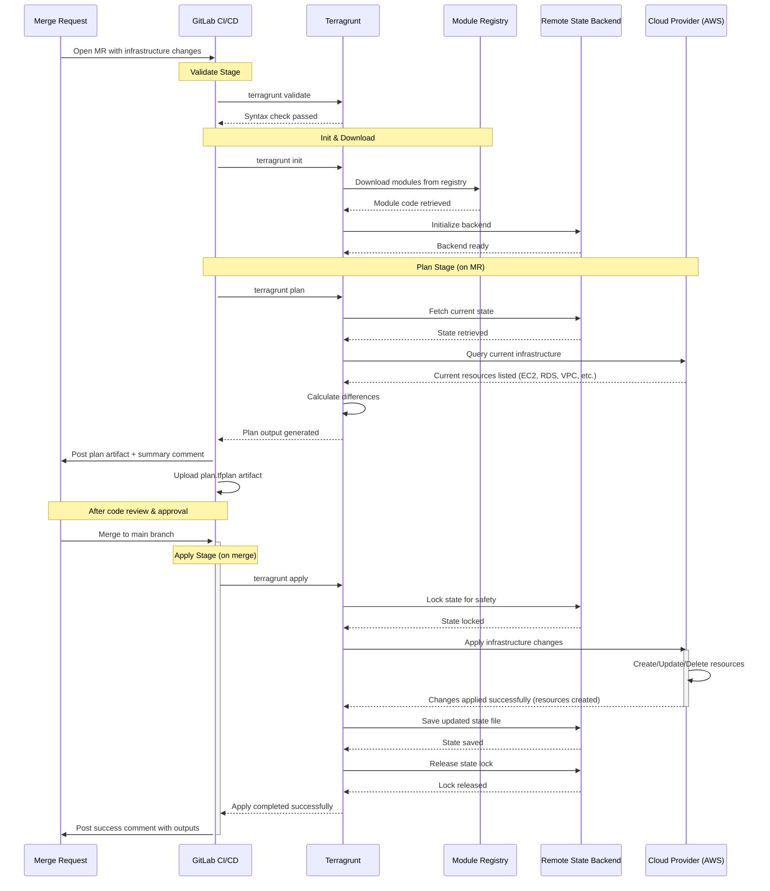

# Terraform/OpenTofu & Terragrunt Infrastructure Guide


A comprehensive guide to setting up Infrastructure as Code (IaC) with Terraform/OpenTofu, Terragrunt, GitLab CI/CD, and GitLab registries.

---

## Table of Contents

| Section | Purpose |
|---------|---------|
| [1. Prerequisites](#1-prerequisites) | Required tools and installation |
| [2. Terraform/OpenTofu Setup](#2-terraformopentofu-setup) | IaC engine configuration |
| [3. Terragrunt Setup](#3-terragrunt-setup) | DRY orchestration layer |
| [4. GitLab Remote Backend](#4-gitlab-remote-backend) | State and lock file management |
| [5. State Management](#5-state-management) | State isolation and best practices |
| [6. Creating Terraform Modules](#6-creating-terraform-modules) | Custom module development |
| [7. GitLab Module Registry](#7-gitlab-module-registry) | Publishing and consuming modules |
| [8. CI/CD Pipeline Setup](#8-cicd-pipeline-setup) | Automated workflows |
| [9. Best Practices](#9-best-practices) | Production-ready patterns |
| [10. References](#10-references) | External documentation |

---

## 1. Prerequisites

### Required Tools

- **OpenTofu** (≥ 1.6) or **Terraform** (≥ 1.3) - Infrastructure as Code engine
- **Terragrunt** (≥ 0.45) - DRY configuration and orchestration wrapper
- **Git** - Version control
- **GitLab Account** - For CI/CD, module registry, and state backend
- **jq** - JSON processing (for scripts)

### Installation

**OpenTofu (Recommended):**

```bash
# Linux/macOS
curl -fsSL https://get.opentofu.org/install-opentofu.sh | bash

# Docker
docker pull ghcr.io/opentofu/opentofu:latest

# Verify
tofu version
```

**Terraform:**

```bash
# Linux
wget https://releases.hashicorp.com/terraform/1.7.0/terraform_1.7.0_linux_amd64.zip
unzip terraform_1.7.0_linux_amd64.zip
sudo mv terraform /usr/local/bin/

# macOS
brew install terraform

# Verify
terraform version
```

**Terragrunt:**

```bash
# Linux
wget https://github.com/gruntwork-io/terragrunt/releases/download/v0.55.0/terragrunt_linux_amd64
chmod +x terragrunt_linux_amd64
sudo mv terragrunt_linux_amd64 /usr/local/bin/terragrunt

# macOS
brew install terragrunt

# Verify
terragrunt --version
```

**Installation References:**
- OpenTofu: https://opentofu.org/docs/intro/install/
- Terraform: https://developer.hashicorp.com/terraform/install
- Terragrunt: https://terragrunt.gruntwork.io/docs/getting-started/install/

---

## 2. Terraform/OpenTofu Setup

### Basic Configuration

Create a simple Terraform configuration:

**main.tf:**

```hcl
terraform {
  required_version = ">= 1.3"
  
  required_providers {
    # Example provider
    http = {
      source  = "hashicorp/http"
      version = "~> 3.4"
    }
  }
}

# Provider configuration
provider "http" {
  # Provider-specific settings
}

# Resources
resource "example_resource" "main" {
  name = "example"
}
```

**variables.tf:**

```hcl
variable "environment" {
  description = "Environment name"
  type        = string
  default     = "dev"
}

variable "config" {
  description = "Configuration object"
  type = object({
    name    = string
    enabled = bool
  })
}
```

**outputs.tf:**

```hcl
output "resource_id" {
  description = "Resource identifier"
  value       = example_resource.main.id
}

output "sensitive_data" {
  description = "Sensitive information"
  value       = example_resource.main.secret
  sensitive   = true
}
```

### Basic Commands

```bash
# Initialize (download providers)
terraform init

# Validate syntax
terraform validate

# Format code
terraform fmt

# Plan changes
terraform plan

# Apply changes
terraform apply

# Destroy resources
terraform destroy

# Show current state
terraform show

# List resources in state
terraform state list
```

---

## 3. Terragrunt Setup

### Why Terragrunt?

Terragrunt adds the following capabilities to Terraform:

- **DRY Configuration** - Eliminate repetition across environments
- **Remote State Management** - Automatic backend configuration
- **Provider Generation** - Dynamic provider configs
- **Dependency Management** - Handle module dependencies
- **Before/After Hooks** - Run commands during workflow
- **Auto-retry** - Handle transient errors

### Project Structure

```
infrastructure/
├── terragrunt.hcl              # Root configuration (optional)
├── environments/
│   ├── root.hcl                # Shared config for all environments
│   ├── dev/
│   │   ├── terragrunt.hcl      # Environment-specific config
│   │   └── terraform.tfvars    # Environment variables
│   ├── staging/
│   │   ├── terragrunt.hcl
│   │   └── terraform.tfvars
│   └── prod/
│       ├── terragrunt.hcl
│       └── terraform.tfvars
└── modules/
    └── my-module/
        ├── main.tf
        ├── variables.tf
        └── outputs.tf
```

### Root Configuration (root.hcl)

```hcl
# environments/root.hcl

# Remote state configuration
remote_state {
  backend = "http"
  generate = {
    path      = "backend.tf"
    if_exists = "overwrite"
  }
  config = {
    address        = "https://<gitlab-host>/api/v4/projects/<project-id>/terraform/state/${basename(get_terragrunt_dir())}"
    lock_address   = "https://<gitlab-host>/api/v4/projects/<project-id>/terraform/state/${basename(get_terragrunt_dir())}/lock"
    unlock_address = "https://<gitlab-host>/api/v4/projects/<project-id>/terraform/state/${basename(get_terragrunt_dir())}/lock"
    username       = get_env("TF_HTTP_USERNAME")
    password       = get_env("TF_HTTP_PASSWORD")
    lock_method    = "POST"
    unlock_method  = "DELETE"
    retry_wait_min = 5
  }
}

# Common locals
locals {
  env_name = basename(get_terragrunt_dir())
}

# Generate provider configuration
generate "provider" {
  path      = "provider.tf"
  if_exists = "overwrite"
  contents  = <<EOF
provider "example" {
  # Provider configuration
  region = var.region
}
EOF
}
```

### Environment Configuration (terragrunt.hcl)

```hcl
# environments/dev/terragrunt.hcl

# Include root configuration
include "root" {
  path = find_in_parent_folders("root.hcl")
}

# Module source
terraform {
  source = "git::https://<gitlab-host>/group/module-repo.git//modules/my-module?ref=v1.0.0"
}

# Environment-specific inputs
inputs = {
  environment = "dev"
  region      = "us-west-2"
}
```

### Terragrunt Commands

```bash
# Initialize
terragrunt init

# Plan
terragrunt plan

# Apply
terragrunt apply

# Destroy
terragrunt destroy

# Run terraform commands directly
terragrunt run-all plan

# Run across all environments
terragrunt run-all apply

# Update dependencies
terragrunt init -upgrade

# Clear cache
rm -rf .terragrunt-cache
```

---

## 4. GitLab Remote Backend

### Why GitLab HTTP Backend?

- **State Storage** - Centralized state file storage
- **State Locking** - Prevent concurrent modifications
- **Version History** - Track state changes over time
- **Access Control** - Leverage GitLab permissions
- **Free Tier** - No additional cost for GitLab users

### Setup Instructions

**1. Create GitLab Personal Access Token**

- Go to GitLab → Settings → Access Tokens
- Create token with `api` scope
- Save token securely

**2. Configure Environment Variables**

```bash
# GitLab credentials for backend
export TF_HTTP_USERNAME="your-gitlab-username"
export TF_HTTP_PASSWORD="your-gitlab-token"

# GitLab API details
export CI_API_V4_URL="https://<gitlab-host>/api/v4"
export CI_SERVER_HOST="<gitlab-host>"
export CI_PROJECT_ID="<your-project-id>"
```

**3. Configure Backend in Terragrunt**

```hcl
# environments/root.hcl
remote_state {
  backend = "http"
  generate = {
    path      = "backend.tf"
    if_exists = "overwrite"
  }
  config = {
    address        = "https://${get_env("CI_SERVER_HOST")}/api/v4/projects/${get_env("CI_PROJECT_ID")}/terraform/state/${basename(get_terragrunt_dir())}"
    lock_address   = "https://${get_env("CI_SERVER_HOST")}/api/v4/projects/${get_env("CI_PROJECT_ID")}/terraform/state/${basename(get_terragrunt_dir())}/lock"
    unlock_address = "https://${get_env("CI_SERVER_HOST")}/api/v4/projects/${get_env("CI_PROJECT_ID")}/terraform/state/${basename(get_terragrunt_dir())}/lock"
    username       = get_env("TF_HTTP_USERNAME", "")
    password       = get_env("TF_HTTP_PASSWORD", "")
    lock_method    = "POST"
    unlock_method  = "DELETE"
    retry_wait_min = 5
  }
}
```

**4. Verify Backend Connection**

```bash
cd environments/dev
terragrunt init

# Should see:
# Initializing the backend...
# Successfully configured the backend "http"!
```

**5. View State in GitLab**

Navigate to: GitLab Project → Infrastructure → Terraform States

### Reference Documentation

- [GitLab Terraform State Backend](https://docs.gitlab.com/user/infrastructure/iac/terraform_state/)

---

## 5. State Management

### State Isolation

**Per-Environment Isolation:**

Use `${basename(get_terragrunt_dir())}` to create unique state files:

```
environments/dev/     → state name: "dev"
environments/staging/ → state name: "staging"
environments/prod/    → state name: "prod"
```

### State Locking

**Automatic Locking:**

GitLab HTTP backend provides automatic locking:
- Lock acquired before `plan` or `apply`
- Lock released after completion
- Prevents concurrent modifications

**Manual Lock Management:**

```bash
# If state is stuck locked
terragrunt force-unlock <LOCK_ID>

# Check lock status in GitLab UI
```

### State Best Practices

1. **Never commit state files** - Add to `.gitignore`:
   ```
   *.tfstate
   *.tfstate.backup
   .terragrunt-cache/
   ```

2. **Use remote backend** - Always configure for team collaboration

3. **Separate environments** - Different state per environment

4. **Backup state** - GitLab maintains version history automatically

5. **State encryption** - Use encrypted connections (HTTPS)

---

## 6. Creating Terraform Modules

### Module Structure

A well-structured module:

```
modules/
└── my-module/
    ├── README.md            # Module documentation
    ├── main.tf              # Primary resources
    ├── variables.tf         # Input variables
    ├── outputs.tf           # Output values
    ├── versions.tf          # Provider requirements
    ├── data.tf              # Data sources (optional)
    └── locals.tf            # Local values (optional)
```

### Example Module

**versions.tf:**

```hcl
terraform {
  required_version = ">= 1.3"
  
  required_providers {
    aws = {
      source  = "hashicorp/aws"
      version = "~> 5.0"
    }
  }
}
```

**variables.tf:**

```hcl
variable "name" {
  description = "Resource name"
  type        = string
}

variable "config" {
  description = "Configuration object"
  type = object({
    size    = string
    enabled = bool
  })
  default = {
    size    = "small"
    enabled = true
  }
}

variable "tags" {
  description = "Resource tags"
  type        = map(string)
  default     = {}
}
```

**main.tf:**

```hcl
resource "aws_instance" "main" {
  ami           = data.aws_ami.ubuntu.id
  instance_type = var.config.size
  
  tags = merge(
    var.tags,
    {
      Name = var.name
    }
  )
}
```

**data.tf:**

```hcl
data "aws_ami" "ubuntu" {
  most_recent = true
  owners      = ["099720109477"]
  
  filter {
    name   = "name"
    values = ["ubuntu/images/hvm-ssd/ubuntu-jammy-22.04-amd64-server-*"]
  }
}
```

**outputs.tf:**

```hcl
output "instance_id" {
  description = "EC2 instance ID"
  value       = aws_instance.main.id
}

output "private_ip" {
  description = "Private IP address"
  value       = aws_instance.main.private_ip
}
```

**README.md:**

```markdown
# My Module

Description of what this module does.

## Usage

\`\`\`hcl
module "example" {
  source = "git::https://gitlab.example.com/group/modules.git//modules/my-module?ref=v1.0.0"
  
  name = "my-instance"
  config = {
    size    = "medium"
    enabled = true
  }
}
\`\`\`

## Inputs

| Name | Type | Description | Default | Required |
|------|------|-------------|---------|----------|
| name | string | Resource name | - | yes |
| config | object | Configuration | see variables.tf | no |

## Outputs

| Name | Description |
|------|-------------|
| instance_id | EC2 instance ID |
| private_ip | Private IP address |
```

### Module Best Practices

1. **Use semantic versioning** - Tag releases with `v1.0.0`, `v1.1.0`, etc.
2. **Document everything** - Clear README with usage examples
3. **Validate inputs** - Use variable validation blocks
4. **Version providers** - Pin provider versions for stability
5. **Output useful data** - Return IDs, URLs, credentials
6. **Mark sensitive outputs** - Use `sensitive = true`
7. **Use consistent naming** - Follow naming conventions
8. **Test modules** - Validate before publishing

---

## 7. GitLab Module Registry

### Publishing Modules to GitLab

GitLab Terraform Module Registry allows you to publish and version modules.

### Setup Instructions

**1. Project Structure**

```
my-terraform-modules/
├── .gitlab-ci.yml
├── .gitlab/
│   └── Terraform-Module-Upload.gitlab-ci.yml
└── modules/
    ├── module-a/
    │   ├── main.tf
    │   ├── variables.tf
    │   └── outputs.tf
    └── module-b/
        ├── main.tf
        ├── variables.tf
        └── outputs.tf
```

**2. Create Upload Job Template**

`.gitlab/Terraform-Module-Upload.gitlab-ci.yml`:

```yaml
.terraform_module_upload:
  image: curlimages/curl:latest
  variables:
    TERRAFORM_MODULE_DIR: ${CI_PROJECT_DIR}
    TERRAFORM_MODULE_NAME: ${CI_PROJECT_NAME}
    TERRAFORM_MODULE_SYSTEM: local  # System/provider name
    TERRAFORM_MODULE_VERSION: ${CI_COMMIT_TAG}
  script:
    # Normalize module name
    - TERRAFORM_MODULE_NAME=$(echo "${TERRAFORM_MODULE_NAME}" | tr " _" -)
    - echo "Uploading module ${TERRAFORM_MODULE_NAME} version ${TERRAFORM_MODULE_VERSION}"
    
    # Define paths
    - MODULE_SOURCE_DIR="${TERRAFORM_MODULE_DIR}/modules/${TERRAFORM_MODULE_NAME}"
    - FILE_NAME="${TERRAFORM_MODULE_SYSTEM}-${TERRAFORM_MODULE_NAME}-${TERRAFORM_MODULE_VERSION}"
    - MODULE_LOCATION="${CI_API_V4_URL}/projects/${CI_PROJECT_ID}/packages/terraform/modules/${TERRAFORM_MODULE_SYSTEM}/${TERRAFORM_MODULE_NAME}/${TERRAFORM_MODULE_VERSION}"
    
    # Create tarball
    - tar -vczf /tmp/${FILE_NAME}.tgz -C ${MODULE_SOURCE_DIR} --exclude=./.git .
    
    # Upload to GitLab
    - |
      curl --fail-with-body \
           --location \
           --header "DEPLOY-TOKEN: ${DEPLOY_TOKEN}" \
           --upload-file /tmp/${FILE_NAME}.tgz \
           ${MODULE_LOCATION}/file
```

**3. Create Pipeline Configuration**

`.gitlab-ci.yml`:

```yaml
include:
  - local: .gitlab/Terraform-Module-Upload.gitlab-ci.yml

stages:
  - upload

upload_module_a:
  extends: .terraform_module_upload
  variables:
    TERRAFORM_MODULE_NAME: module-a
  stage: upload
  rules:
    - if: $CI_COMMIT_TAG

upload_module_b:
  extends: .terraform_module_upload
  variables:
    TERRAFORM_MODULE_NAME: module-b
  stage: upload
  rules:
    - if: $CI_COMMIT_TAG
```

**4. Create Deploy Token**

GitLab Project → Settings → Repository → Deploy Tokens:
- Name: `module-publisher`
- Scopes: `write_package_registry`
- Save the token

**5. Add CI/CD Variable**

GitLab Project → Settings → CI/CD → Variables:
- Key: `DEPLOY_TOKEN`
- Value: `<your-deploy-token>`
- Masked: ✓
- Protected: ✓

**6. Publish a Version**

```bash
# Tag a release
git tag -a v1.0.0 -m "Release version 1.0.0"
git push origin v1.0.0

# Pipeline runs automatically
# Module published to GitLab Package Registry
```

**7. View Published Modules**

Navigate to: GitLab Project → Deploy → Package Registry

### Consuming Modules

**From GitLab Registry (via Git):**

```hcl
# In Terragrunt
terraform {
  source = "git::https://<gitlab-host>/group/modules.git//modules/module-a?ref=v1.0.0"
}

# In Terraform
module "example" {
  source = "git::https://<gitlab-host>/group/modules.git//modules/module-a?ref=v1.0.0"
}
```

**With Authentication (.netrc):**

```bash
cat > ~/.netrc <<EOF
machine <gitlab-host>
    login <username>
    password <token>
EOF
chmod 600 ~/.netrc
```

### Module Versioning

**Semantic Versioning:**

- `v1.0.0` - Major (breaking changes)
- `v1.1.0` - Minor (new features, backward compatible)
- `v1.1.1` - Patch (bug fixes)

**Version Constraints:**

```hcl
# Exact version
source = "...?ref=v1.0.0"

# Branch (not recommended for production)
source = "...?ref=main"

# Commit hash
source = "...?ref=abc123"
```

### References

- [GitLab Terraform Module Registry](https://docs.gitlab.com/user/packages/terraform_module_registry/)

---

## 8. CI/CD Pipeline Setup

### Infrastructure Pipeline

Automate Terraform/Terragrunt workflows with GitLab CI/CD.

### Pipeline Structure

**Stages:**
1. **Validate** - Check syntax and configuration
2. **Plan** - Preview changes (on MR)
3. **Apply** - Execute changes (on merge to main)

### Example Pipeline

`.gitlab-ci.yml`:

```yaml
stages:
  - validate
  - plan
  - apply

variables:
  TG_VERSION: "0.55.0"
  TF_VERSION: "1.7.0"

# Job template
.terragrunt_job:
  image: alpine/terragrunt:${TG_VERSION}
  before_script:
    - cd environments/${ENVIRONMENT}
  cache:
    key: ${ENVIRONMENT}
    paths:
      - environments/${ENVIRONMENT}/.terragrunt-cache

# Validate job
validate:
  extends: .terragrunt_job
  stage: validate
  parallel:
    matrix:
      - ENVIRONMENT: [dev, staging, prod]
  script:
    - terragrunt validate
  rules:
    - if: $CI_PIPELINE_SOURCE == "merge_request_event"
    - if: $CI_COMMIT_BRANCH == $CI_DEFAULT_BRANCH

# Plan job
plan:
  extends: .terragrunt_job
  stage: plan
  parallel:
    matrix:
      - ENVIRONMENT: [dev, staging, prod]
  script:
    - terragrunt init
    - terragrunt plan -out=plan.tfplan
  artifacts:
    paths:
      - environments/${ENVIRONMENT}/plan.tfplan
    expire_in: 1 week
  rules:
    - if: $CI_PIPELINE_SOURCE == "merge_request_event"

# Apply job
apply:
  extends: .terragrunt_job
  stage: apply
  parallel:
    matrix:
      - ENVIRONMENT: [dev, staging, prod]
  script:
    - terragrunt init
    - terragrunt apply -auto-approve
  rules:
    - if: $CI_COMMIT_BRANCH == $CI_DEFAULT_BRANCH
      when: manual
  environment:
    name: ${ENVIRONMENT}
```

### Advanced Pipeline Features

**Plan Summary in MR:**

```yaml
plan:
  script:
    - terragrunt plan -no-color | tee plan.txt
    - |
      curl --request POST \
           --header "PRIVATE-TOKEN: ${GITLAB_TOKEN}" \
           "${CI_API_V4_URL}/projects/${CI_PROJECT_ID}/merge_requests/${CI_MERGE_REQUEST_IID}/notes" \
           --data "body=\`\`\`\n$(cat plan.txt)\n\`\`\`"
```

**Conditional Apply:**

```yaml
apply:dev:
  extends: .terragrunt_job
  variables:
    ENVIRONMENT: dev
  rules:
    - if: $CI_COMMIT_BRANCH == $CI_DEFAULT_BRANCH
      when: on_success  # Auto-apply for dev

apply:prod:
  extends: .terragrunt_job
  variables:
    ENVIRONMENT: prod
  rules:
    - if: $CI_COMMIT_BRANCH == $CI_DEFAULT_BRANCH
      when: manual  # Manual approval for prod
```

### Required CI/CD Variables

Set in GitLab Project → Settings → CI/CD → Variables:

- `TF_HTTP_USERNAME` - GitLab username for state backend
- `TF_HTTP_PASSWORD` - GitLab token for state backend
- `GITLAB_TOKEN` - Token for API access (optional, for MR comments)
- Provider-specific variables (e.g., `AWS_ACCESS_KEY_ID`)

### Pipeline Sequence Diagram (Example: AWS Infrastructure)



---

## 9. Best Practices

### Code Organization

1. **Separate environments** - Distinct directories for dev/staging/prod
2. **Use modules** - Reusable components in `modules/`
3. **Version everything** - Git tags for modules and infrastructure
4. **Document changes** - Clear commit messages and MR descriptions

### Security

1. **Never commit secrets** - Use environment variables or secret managers
2. **Use `.gitignore`** - Exclude state files and credentials
3. **Encrypt state** - Use HTTPS backend with authentication
4. **Rotate credentials** - Regularly update tokens and passwords
5. **Least privilege** - Minimal permissions for CI/CD and users

### State Management

1. **Remote backend** - Always use for team collaboration
2. **State locking** - Prevent concurrent modifications
3. **Separate state** - Per environment and per component
4. **Backup regularly** - GitLab maintains history automatically

### Module Development

1. **Semantic versioning** - Clear version numbers
2. **Comprehensive docs** - README with examples
3. **Input validation** - Validate variable types and values
4. **Testing** - Test modules before publishing
5. **Changelog** - Document changes between versions

### CI/CD

1. **Plan on MR** - Review changes before merge
2. **Manual prod apply** - Human approval for production
3. **Artifact storage** - Keep plan files for review
4. **Pipeline caching** - Speed up builds with caching
5. **Notifications** - Alert on failures

---

## 10. References

### Official Documentation

- [Terraform Documentation](https://developer.hashicorp.com/terraform/docs)
- [OpenTofu Documentation](https://opentofu.org/docs/)
- [Terragrunt Documentation](https://terragrunt.gruntwork.io/)
- [GitLab Terraform Integration](https://docs.gitlab.com/ee/user/infrastructure/iac/)

### GitLab Specific

- [GitLab Terraform State Backend](https://docs.gitlab.com/user/infrastructure/iac/terraform_state/)
- [GitLab Terraform Module Registry](https://docs.gitlab.com/user/packages/terraform_module_registry/)
- [GitLab CI/CD for Terraform](https://docs.gitlab.com/ee/user/infrastructure/iac/)

### Community Resources

- [Terraform Registry](https://registry.terraform.io/)
- [Terraform Best Practices](https://www.terraform-best-practices.com/)
- [Terragrunt Cookbook](https://terragrunt.gruntwork.io/docs/getting-started/quick-start/)

### Learning Resources

- [HashiCorp Learn - Terraform](https://learn.hashicorp.com/terraform)
- [OpenTofu Migration Guide](https://opentofu.org/docs/intro/migration/)

---

## Contributing

Contributions and improvements to this guide are welcome!

---

## License

This documentation is provided as-is for educational and reference purposes.
